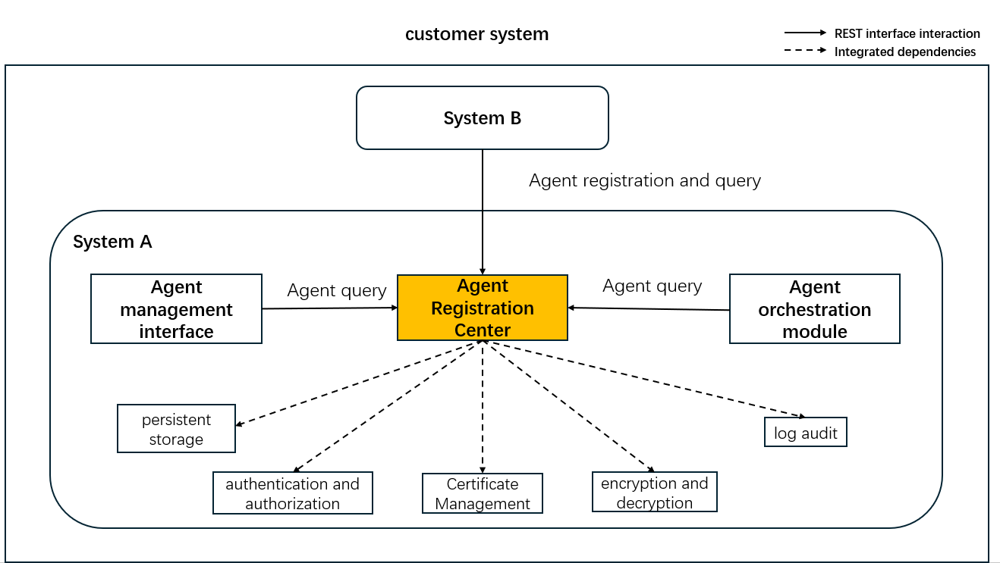
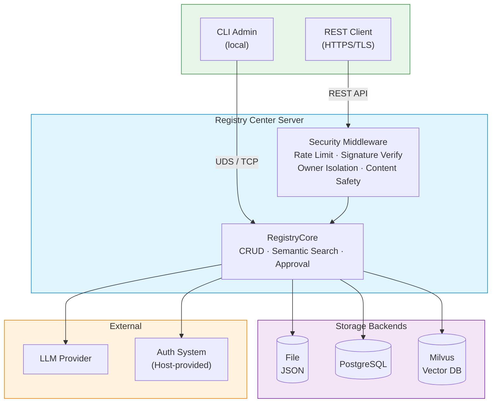

<!--
Copyright (c) 2026 Huawei Technologies Co., Ltd.
All Rights Reserved.

SPDX-License-Identifier: Apache-2.0

   Licensed under the Apache License, Version 2.0 (the "License"); you may
   not use this file except in compliance with the License. You may obtain
   a copy of the License at

        http://www.apache.org/licenses/LICENSE-2.0

   Unless required by applicable law or agreed to in writing, software
   distributed under the License is distributed on an "AS IS" BASIS, WITHOUT
   WARRANTIES OR CONDITIONS OF ANY KIND, either express or implied. See the
   License for the specific language governing permissions and limitations
   under the License.
-->

# A2A-T AgentCard Registry Center

<p align="center">
  <a href="https://www.python.org/"></a>
  <a href="LICENSE"></a>
</p>

<p align="center">
  <strong>A centralized registry for managing AgentCards across multi-vendor AI agents in the A2A-T ecosystem.</strong>
  <br>
  面向 A2A-T 生态的多厂商智能体 AgentCard 统一注册与管理服务。
</p>

<p align="center">
  <a href="./README_zh.md">中文</a>
</p>

---

## Overview

The Registry Center provides unified lifecycle management for **AgentCards** — structured descriptions of AI agents from different vendors. Built for the A2A-T protocol ecosystem, it enables controlled onboarding, discovery, and governance of multi-source agents.

**Use cases:** Telecom operators managing RAN optimization agents, enterprise platforms orchestrating vendor-provided AI services, internal systems with agent approval workflows.



## Features

| Category | Capability |
|----------|------------|
| **AgentCard CRUD** | Register, query (by name/organization), update, and deregister agent descriptions |
| **Semantic Search** | Natural-language task matching over published AgentCards via LLM; model failures return 503. Legacy Milvus mode remains experimental and does not provide SQL-backed approval/ownership parity: those endpoints answer 503 instead of empty results |
| **Agent Approval** | Optional manual review workflow — agents start as `registered`, admins promote to `published` |
| **Tag Management** | Independent tag entities with full CRUD, assignable to agents |
| **TLS Security** | TLS 1.2/1.3 with strong cipher suites, mutual TLS client certificate verification |
| **Signature Verification** | JWS-based AgentCard integrity checks (RS256, ES256), static JWK or dynamic `jku` lookup. `jku` lookup is gated by an operator-configured host allowlist (`jwk_allowlist` in `etc/conf/server.conf`, or `REGISTRY_JWK_ALLOWLIST`); with no allowlist configured the `jku` path is disabled (fail closed) and only backend keys are used |
| **Owner Isolation** | Ownership from verified TLS client certificates or an explicitly trusted proxy; ownerless legacy cards require administrative ownership assignment |
| **Content Safety** | Prompt injection and high-risk skill blacklist filtering on registration |
| **Rate Limiting** | Per-endpoint rate limits (configurable: 50–100 req/s, JWK endpoint: 10 req/s) with moving-window algorithm |
| **Heartbeat Detection** | Agents periodically report liveness; configurable failure threshold and grace period to identify offline agents promptly |
| **Change Broadcast** | Best-effort webhooks to operator-allowlisted destinations, with HMAC signing and version-based reconciliation; version allocation is commit-ordered in the SQL persistence modes (deployment stays single-instance) and delivery state is tracked per subscriber, while retry-after-failure and exactly-once semantics are not yet guaranteed |
| **Audit Logging** | Rotating JSON audit log (time, client IP, user, operation, object, result) |
| **CLI Administration** | Interactive CLI for agent approval, tag management, and full agent listing |
| **Custom Extensions** | Pluggable handlers (auth, audit, decrypt, storage) and LLM providers |

See [upgrade and deployment notes](docs/en/Registry%20Center%20Upgrade%20Notes.md)
([中文](docs/zh/注册中心升级与部署说明.md)) for identity configuration, approval
visibility, legacy-event synchronization, and container probe setup. The generic
knowledge-graph API is pre-embedded and disabled by default; enabling it requires
an authenticated operator and separate graph permissions. `docker-compose.yml`
is a loopback-only development example with client authentication disabled;
it is not a production access-policy template.

## Quick Start

### Prerequisites
- **Python** 3.12+
- **OS**: Linux for production; Windows supported for development/debugging

### Install & Run

```bash
# Clone the repository
git clone https://github.com/project-openan/registry-center.git
cd registry-center

# Create and activate a virtual environment
python3 -m venv .venv
source .venv/bin/activate      # Linux
# .venv\Scripts\activate       # Windows

# Install dependencies
pip install -r requirements.txt

# Interactive configuration wizard (certificates, storage, security options)
python -m agent_registry.init

# Start the service
python -m agent_registry.start
```

The service starts on `https://127.0.0.1:5000` by default (HTTPS). For a quick test without certificates:

```bash
python -m agent_registry.init    # choose: enable_https = false
python -m agent_registry.start   # starts on http://127.0.0.1:5000
```

For Docker/Podman packaging, runtime secret mounts, port precedence and
non-interactive initialization, see [Container deployment](docs/container-deployment.md).

### Register Your First Agent

```bash
curl -X POST http://127.0.0.1:5000/rest/v1/registry-center/agent-cards \
  -H "Content-Type: application/json" \
  -d '{
    "agentCards": [{
      "name": "My Agent",
      "description": "An example agent for demonstration.",
      "version": "1.0.0",
      "provider": {"organization": "MyOrg", "url": "https://example.com"},
      "capabilities": {"streaming": true, "pushNotifications": false},
      "skills": [{
        "id": "example-skill",
        "name": "Example Skill",
        "description": "Demonstrates basic agent registration."
      }],
      "supportedInterfaces": [{
        "url": "http://127.0.0.1:8080/",
        "protocolBinding": "HTTP+JSON",
        "protocolVersion": "1.0.0"
      }]
    }]
  }'
```

## Architecture



## API Overview

| Method | Endpoint | Description |
|--------|----------|-------------|
| `POST` | `/rest/v1/registry-center/agent-cards` | Register an AgentCard |
| `GET` | `/rest/v1/registry-center/agent-cards` | Query agents (by name/organization) |
| `GET` | `/rest/v1/registry-center/agent-cards/{org}/{name}` | Get a specific agent |
| `PUT` | `/rest/v1/registry-center/agent-cards/{org}/{name}` | Update an agent |
| `DELETE` | `/rest/v1/registry-center/agent-cards/{org}/{name}` | Deregister an agent |
| `POST` | `/rest/v1/registry-center/agent-cards/semantic-query` | Semantic search by task description |
| `POST` | `/rest/v1/registry-center/agent-cards-with-layer` | Layer-aware AgentCard query |
| `GET` | `/rest/v1/registry-center/agent-cards-with-layer/{org}/{name}` | Get an AgentCard with its layer |
| `POST` | `/rest/v1/registry-center/agent-cards-with-layer/semantic-query` | Layer-aware semantic search |
| `GET` | `/rest/v1/registry-center/keys` | Retrieve registry signing public keys (JWK Set) |
| `POST` | `/rest/v1/registry-center/agent-cards/{org}/{name}/heartbeat` | Report agent heartbeat |
| `GET` | `/rest/v1/registry-center/agents/health` | Query agent health status list |
| `POST` | `/rest/v1/registry-center/subscriptions` | Create a change subscription |
| `GET` | `/rest/v1/registry-center/subscriptions` | List subscriptions |
| `DELETE` | `/rest/v1/registry-center/subscriptions/{id}` | Delete a subscription |
| `GET` | `/rest/v1/registry-center/changes` | Change reconciliation (incremental pull by version) |

See the [API Reference](docs/en/Registry%20Center%20API%20Reference.md) for full request/response schemas, error codes, and constraints.

## Configuration

| Config File | Purpose |
|-------------|---------|
| `etc/conf/server.conf` | Feature switches and deployment/access settings: IP, port, TLS/credential references, IAM endpoints and identity modes |
| `etc/conf/server.properties` | Operating parameters and business policies: TLS versions/ciphers, limits, heartbeat timing, notification retry and OAuth cache/scope policies |
| `etc/conf/persistence.conf` | Storage backend: `file` (default), `postgresql` |
| `etc/conf/log_config.conf` | Audit log rotation (size, backup count) |
| `.env` | Local secrets (gitignored); model definitions live in `etc/config/models.yaml` |

Define each key in only one server file. Loading order remains `server.conf` →
`server.properties` → `REGISTRY_*` environment overrides. Duplicate definitions
produce a warning containing key names only; historical last-loaded precedence
is preserved for existing deployments. When migrating policies from `server.conf`,
move their **effective values**, not template defaults, into `server.properties`,
then remove the old definitions. The initialization wizard only edits deployment
and feature settings. The image initializes from `server.conf.example` plus the
public `server.properties`; local deployment files and secrets are not image inputs.

Model definitions live in the gitignored `etc/config/models.yaml` (copy
[`models.yaml.example`](etc/config/models.yaml.example)), while secrets come
from environment variables or a local gitignored `.env` (see
[`.env.example`](.env.example)). Built-in `openai_compatible` (`openai` alias) and `aoc_signed` profiles
provide request/response contracts, while each `models:` entry sets `model` and
`url` and names its secret through `api_key_env` or `auth.<field>_env`. The same
structure is used by Orchestration Center. Environment variables override
`.env`; restart the process after changing either source. A new model using an
existing protocol needs only configuration; a new protocol registers a profile
in `common/llm/config/model_sources.py` and adds tests.
Existing installations can run `python -m scripts.migrate_llm_config` once;
the application no longer reads or tracks the old JSON.

Configure interactively:

```bash
python -m agent_registry.init
```

## Documentation

| Document | Description |
|----------|-------------|
| [User Guide](docs/en/Registry%20Center%20User%20Guide.md) | Features, deployment, CLI quick reference, FAQ |
| [Development Guide](docs/en/Registry%20Center%20Development%20Guide.md) | Architecture, registration workflow, custom LLM/handler extensions |
| [API Reference](docs/en/Registry%20Center%20API%20Reference.md) | Full REST API specification with request/response examples |
| [Security Guide](docs/en/Registry%20Center%20Security%20Guide.md) | TLS, access control, audit logging, content safety, certificate tooling |
| [GCP Containerized Deployment Guide](docs/en/Registry%20Center%20GCP%20Containerized%20Deployment%20Guide.md) | Containerized deployment of Registry Center on Google Cloud Platform |
| [LLM Config](etc/config/README_en.md) | LLM configuration file reference |

> For Chinese documentation, see [中文 README](README_zh.md) or [docs/zh/](docs/zh/).

## Deployment

This project is delivered as **source code only**. Users are responsible for:

1. **Build & install** dependencies on a Linux server
2. **Provision TLS certificates** (development only: `python -m generate_selfsign_cert etc/ssl serverAuth`).
   This writes `server.cer`, `server_key.pem`, `cert_pwd` and `trust.cer` at the default TLS paths,
   with loopback SANs. Existing outputs are never overwritten; protect the plaintext password
   and keys (service-account ACLs on Windows). Keep signing material separate:
   `python -m generate_selfsign_cert etc/sign_cert dataSigning` matches the public `jwk_*` template.
3. **Configure** via `python -m agent_registry.init`
4. **Integrate** authentication, authorization, and database infrastructure from the host system
5. **Set minimal file permissions** (e.g., files `400`, directories `700`)

> **Warning:** This is an internal system module. Do not expose it to the public internet without additional firewall, WAF, and authentication layers.

## Constraints

- Single-instance deployment (not distributed)
- Linux production; Windows development/debugging only
- Max 100 registered agents (configurable via `agent.num.max`)
- 1 MB request body limit
- AgentCards must not contain personal data or sensitive credentials

## License

This project is licensed under the **Apache License 2.0**. See [LICENSE](LICENSE) for details.


数据库连接统一使用 `etc/conf/db/` 模板，密码由 `.env` / 环境变量引用；参见 [Database configuration / 数据库配置](docs/database-configuration.md)。旧连接配置不再作为运行时来源。
