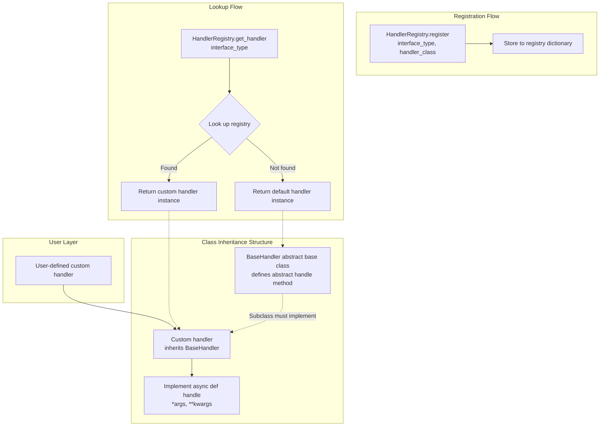

<!--
Copyright (c) 2026 Huawei Technologies Co., Ltd.
All Rights Reserved.

SPDX-License-Identifier: Apache-2.0

   Licensed under the Apache License, Version 2.0 (the "License"); you may
   not use this file except in compliance with the License. You may obtain
   a copy of the License at

        http://www.apache.org/licenses/LICENSE-2.0

   Unless required by applicable law or agreed to in writing, software
   distributed under the License is distributed on an "AS IS" BASIS, WITHOUT
   WARRANTIES OR CONDITIONS OF ANY KIND, either express or implied. See the
   License for the specific language governing permissions and limitations
   under the License.
-->
# Registry Center Development Guide

## Feature Overview

Registry Center is a service focused on unified Agent management, enabling users to centrally register and manage Agents from different vendors, achieving controlled access and maintenance of multi-source Agents. It is designed for unified AgentCard registration and management in multi-vendor, multi-agent interaction scenarios within the A2A-T domain.

## Constraints and Limitations

### Functional Limitations

- This project is intended as a functional module only, not a complete system. The module itself does not provide login authentication, authorization, user management, audit logging, encryption/decryption, key management, database, or other capabilities. These security infrastructures must be provided by the customer system. Hook methods have been reserved in the source code for secondary customization.
- Registered Agents are shared resources by default: read paths expose only cards whose status is `published`. Ownership enforcement (`owner.isolation.enabled`) is off by default; when enabled, the owner comes from the verified TLS client certificate or an explicitly trusted proxy, and cards without an owner require administrative ownership assignment. See the [Security Guide](Registry%20Center%20Security%20Guide.md) for the identity trust chain.
- AgentCards registered with this project must not contain personal data such as phone numbers, or sensitive information such as passwords or credentials, as doing so poses a risk of information leakage.
- This project only supports AgentCard registration in Chinese and English.
- Currently supports single-instance deployment, intended for internal systems only. It must not be exposed to the public internet and must not be deployed as a cloud service.

### Operational Limitations

1. The production environment for this project must run on a Linux system and supports IPv4 environments. Windows environments may be used for development and debugging; a warning log will be output at startup.

2. The maximum number of registered Agents defaults to 100 (configurable via `agent.num.max` in `etc/conf/server.properties`).

3. Request body size is limited to 1MB, and URL length is limited to 1KB.

4. Interface concurrency limits:
   - Registration interface: max 50 concurrent
   - Query interface: max 100 concurrent
   - Update interface: max 100 concurrent
   - Deregistration interface: max 50 concurrent
   - JWK interface: max 1 concurrent

5. Interface rate limiting:
   - Registration interface: 50 requests/second
   - Query interface: 100 requests/second
   - JWK interface: 10 requests/second

6. Custom handler registration timing:
   - Registration should be completed at application startup to avoid registering during business processing.

7. Custom LLM implementation timing:
   - Custom LLM implementations should be completed before application startup to avoid the custom LLM not being found after startup.

### Certificate Requirements

- server.cer: Required, identity certificate. Only PEM encoding format supported. RSA key length >= 3072 bits.
- server_key.pem: Required, private key file. Only PEM encoding format supported.
- cert_pwd: Required, private key passphrase file. Passphrase complexity must meet at least 8 characters and at least two character types.
- trust.cer: Required (when verify_client=true), trust certificate.
- National cryptographic (Guomi) certificates are not supported.

## Environment Preparation

### Environment Requirements

- OS: Linux (production environment); Windows for development and debugging
- Python Version: 3.12+
- Network: IPv4 environment
- Storage: Supports file storage, PostgreSQL (SQLite and GaussDB code reserved; the current initialization tool only supports file and postgresql)

### Setting Up the Environment

1. Obtain the source code

    ```bash
    git clone https://github.com/project-openan/registry-center.git
    cd registry-center
    ```

2. Create a virtual environment

    ```bash
    # Linux environment
    python3 -m venv myproject_env
    source myproject_env/bin/activate
    ```

3. Install dependencies

    ```bash
    pip install -r requirements.txt
    ```

4. Configure the service

    Run the initialization command for interactive configuration:

    ```bash
    python -m agent_registry.init
    ```

    Configuration items include:
    - HTTPS enable setting
    - TLS certificate path configuration
    - Signing certificate configuration
    - Signature verification toggle
    - Agent approval toggle
    - Storage mode configuration (file/postgresql)

    Configuration file paths:
    - Service configuration: `etc/conf/server.conf`
    - Persistence configuration: `etc/conf/persistence.conf`
    - LLM configuration: model definitions in `etc/config/models.yaml`, secrets in `.env` or the process environment (see [Appendix 4](#appendix-4-llm-configuration-guide))

5. Certificate preparation

    Place certificate files into the `etc/ssl/` directory:
    ```
    etc/ssl/server.cer      # Server identity certificate
    etc/ssl/server_key.pem  # Server private key
    etc/ssl/cert_pwd        # Private key passphrase file
    etc/ssl/trust.cer       # Trust certificate
    ```

    Set certificate file permissions:
    ```bash
    chmod 400 etc/ssl/*
    chmod 700 etc/ssl/
    ```

6. Configure the LLM

    Define each capability under `models:` in `etc/config/models.yaml` and name its secret through `api_key_env` there, keeping the value in the repository-root `.env` or process environment. Use `provider: aoc_signed` with `auth.app_key_env` / `auth.app_secret_env` for AOC endpoints. See [Appendix 4](#appendix-4-llm-configuration-guide) and [`models.yaml.example`](../../etc/config/models.yaml.example).

7. Verify the environment setup

    Start the service and check the logs:
    
    ```bash
    nohup python -m agent_registry.start > agent_registry.log 2>&1 &
    tail -f agent_registry.log
    ```
    
    The following log indicates successful startup:
    ```
    Uvicorn running on https://127.0.0.1:5000
    ```
    
    Verify that the LLM configuration loaded successfully:
    
     ```bash
     python -c "from common.llm import get_llm_instance, get_embed_instance; print(get_llm_instance().to_dict()); print(get_embed_instance().to_dict())"
     ```

## Agent Registration Scenario

### Use Case Overview

This scenario describes how to register an Agent with the Registry Center, including AgentCard construction, signature verification flow, and post-registration management.

### System Architecture

The Registry Center system architecture is as follows:

```
┌─────────────────────────────────────────────────────────────────┐
│                     Client (Agent Provider)                      │
│  ┌─────────────┐    ┌─────────────┐    ┌─────────────────┐       │
│  │ AgentCard   │ -> │ Signature   │ -> │ REST API        │       │
│  │ Construction│    │ Generation  │    │ Request         │       │
│  └─────────────┘    └─────────────┘    └─────────────────┘       │
└─────────────────────────────────────────────────────────────────┘
                              │
                              │ HTTPS/TLS
                              ▼
┌─────────────────────────────────────────────────────────────────┐
│                   Registry Center Service                        │
│  ┌─────────────┐    ┌─────────────┐    ┌─────────────────┐       │
│  │ TLS         │ -> │ Signature   │ -> │ Security Check  │       │
│  │ Verification│    │ Verification│    │ (Prompt Inject, │       │
│  │             │    │             │    │  etc.)          │       │
│  └─────────────┘    └─────────────┘    └─────────────────┘       │
│                              │                                   │
│                              ▼                                   │
│  ┌─────────────┐    ┌─────────────┐    ┌─────────────────┐       │
│  │ Agent       │ -> │ Persistence │ -> │ Approval Flow   │       │
│  │ Registry    │    │             │    │ (Optional)      │       │
│  └─────────────┘    └─────────────┘    └─────────────────┘       │
└─────────────────────────────────────────────────────────────────┘
                              │
                              ▼
┌─────────────────────────────────────────────────────────────────┐
│                       Storage Layer                              │
│  ┌─────────────┐    ┌─────────────┐    ┌─────────────────┐       │
│  │ File        │    │ PostgreSQL  │    │ VectorDB        │       │
│  │ (Default)   │    │             │    │ (Optional)      │       │
│  └─────────────┘    └─────────────┘    └─────────────────┘       │
└─────────────────────────────────────────────────────────────────┘
```

Core Component Description:
- **Agent Registry**: Core registration logic, manages CRUD operations for AgentCards
- **AgentCardSignatureValidator**: Signature verification component
- **JWKProvider**: Public key provision component, used for signature verification
- **Persistence**: Persistence layer, supports multiple storage modes

### Development Flow

Agent registration development flow:

```
1. Build AgentCard
      │
      ▼
2. Generate AgentCard Signature (Optional)
      │
      ▼
3. Configure Verification Public Key (if signature verification is enabled)
      │
      ▼
4. Send Registration Request
      │
      ▼
5. Verify Registration Result
```

### Interface Description

**Table 1** Primary Interface List

| Interface | Description |
|-----------|-------------|
| POST /rest/v1/registry-center/agent-cards | Register AgentCard |
| GET /rest/v1/registry-center/agent-cards | Query AgentCard list |
| GET /rest/v1/registry-center/agent-cards/{org}/{name} | Query a specific AgentCard |
| PUT /rest/v1/registry-center/agent-cards/{org}/{name} | Update a specific AgentCard |
| DELETE /rest/v1/registry-center/agent-cards/{org}/{name} | Delete a specific AgentCard |
| POST /rest/v1/registry-center/agent-cards/semantic-query | Semantic search for AgentCards |
| GET /rest/v1/registry-center/keys | Get public key information |

For detailed interface parameters, please refer to [Registry Center API Reference](./Registry Center API Reference.md).

### Development Steps

1. Build an AgentCard

    An AgentCard is the description information of an Agent, containing the following core fields:
    
    ```python
    from a2a.types import AgentCard, AgentProvider, AgentSkill, AgentCapabilities, AgentInterface
    
    agent_card = AgentCard(
        name="RAN Energy Saving Agent",
        description="Responsible for autonomous closed-loop RAN energy efficiency optimization, including intent exploration, intent implementation, effect evaluation and reporting.",
        version="1.0.0",
        provider=AgentProvider(
            organization="Huawei",
            url="https://www.huawei.com"
        ),
        skills=[
            AgentSkill(
                id="ran-es-intent-exploration",
                name="RAN ES Intent Exploration",
                description="Evaluate and determine the best feasibility for a given RAN ES intent target",
                tags=["wireless", "energy-saving", "intent"]
            )
        ],
        capabilities=AgentCapabilities(
            streaming=True,
            push_notifications=False
        ),
        supported_interfaces=[
            AgentInterface(
                protocol_binding="GRPC",
                protocol_version="1.0.0",
                url="http://127.0.0.1:5000/"
            )
        ]
    )
    ```

    Notes:
    - The combination of `name` and `provider.organization` serves as the unique identifier and cannot be registered more than once.
    - `description` length limit: 1~1000 characters.
    - `skills`: maximum 100, each skill description up to 4096 characters.
    - Prompt injection keywords and high-risk skill descriptions are prohibited. See [AgentCard Security Specification](../../design/AgentCard_Security_Specification.md) for details.

2. Generate a signature (optional)

    If signature verification is required, generate a signature for the AgentCard:

    ```python
    from a2a.utils.signing import create_signer
    from cryptography.hazmat.primitives import serialization
    
    # Load private key
    with open("sign_key.pem", "rb") as f:
        private_key = serialization.load_pem_private_key(f.read(), password=None)
    
    # Create signer and sign
    signer = create_signer(private_key, "RS256")
    signed_agent_card = signer(agent_card)
    ```

    Signature requirements:
    - Supported algorithms: RS256, ES256
    - The corresponding public key must be configured at `etc/sign_verify/jwks/{org}/{agent_name}.json` in the Registry Center

3. Configure the verification public key

    Configure the verification public key in the Registry Center:
    
    ```bash
    # Public key file format: JWK Set
    mkdir -p etc/sign_verify/jwks/Huawei
    cat > etc/sign_verify/jwks/Huawei/TestAgent.json << 'EOF'
    {
      "keys": [
        {
          "kty": "RSA",
          "n": "base64url-encoded-modulus",
          "e": "AQAB",
          "alg": "RS256",
          "use": "sig",
          "kid": "test-key-1"
        }
      ]
    }
    EOF
    ```

4. Send a registration request

    Use HTTPS to send the registration request:
    
    ```python
    import requests
    import json
    
    # Serialize AgentCard
    agent_dict = {
        "name": "RAN Energy Saving Agent",
        "description": "Responsible for autonomous closed-loop RAN energy efficiency optimization",
        "version": "1.0.0",
        "provider": {"organization": "Huawei", "url": ""},
        "skills": [...],
        "capabilities": {"streaming": True, "push_notifications": False},
        "supported_interfaces": [...]
    }
    
    # Send request
    response = requests.post(
        "https://127.0.0.1:5000/rest/v1/registry-center/agent-cards",
        json={"agentCards": [agent_dict]},
        cert=("client.cer", "client_key.pem"),  # Client certificate
        verify="trust.cer"  # Trust certificate
    )
    
    print(f"Status: {response.status_code}")
    ```

5. Verify the registration result

    Query the registered Agent:
    
    ```python
    # Query a specific Agent
    response = requests.get(
        "https://127.0.0.1:5000/rest/v1/registry-center/agent-cards/Huawei/RAN%20Energy%20Saving%20Agent",
        cert=("client.cer", "client_key.pem"),
        verify="trust.cer"
    )
    
    agent_data = response.json()
    print(json.dumps(agent_data, indent=2))
    ```

### Testing and Verification

#### Verify Service Status

```bash
# View service logs
tail -f agent_registry.log

# View registration count
curl -k --cert client.cer --key client_key.pem \
  https://127.0.0.1:5000/rest/v1/registry-center/agent-cards
```

#### Verify Signature Functionality

```bash
# Get Registry Center public key
curl -k https://127.0.0.1:5000/rest/v1/registry-center/keys

# Verify AgentCard signature validity (test via registration interface)
```

#### Verify Storage Status

```bash
# File storage mode: view data files
cat data/agentcard.json
cat data/agentregistry.json
cat data/tags.json
```

## Semantic Search Scenario

### Use Case Overview

The semantic search scenario is used to intelligently match the most suitable Agent based on natural language task descriptions.

### Development Flow

```
1. Build Task Description
      │
      ▼
2. Send Semantic Search Request
      │
      ▼
3. Retrieve Matching Agent List
```

### Development Steps

1. Build a task description

    The task description should be in natural language, describing the task to be completed:

    ```json
    {
      "task": "Need to query intent reports"
    }
    ```

2. Send a search request

    ```python
    import requests

    response = requests.post(
        "https://127.0.0.1:5000/rest/v1/registry-center/agent-cards/semantic-query",
        json={"task": "Need to query intent reports"},
        cert=("client.cer", "client_key.pem"),
        verify="trust.cer"
    )
    ```

3. Process the search results

    ```python
    result = response.json()
    for agent in result.get("agentCards", []):
        print(f"Agent: {agent['name']}")
        print(f"Description: {agent['description']}")
    ```

    Notes:
    - Search is based on semantic matching of the Agent's description and skills.
    - An LLM is used for intelligent filtering.
    - Returns a maximum of top_n matching results.

## CLI Management Scenario

### Use Case Overview

The Registry Center provides a CLI command-line tool for local management of Agents and tags.

### Development Steps

1. Launch the CLI

    ```bash
    python -m agent_registry.cli
    ```

2. Agent management commands

    ```bash
    # Query Agent list
    agent list

    # Query Agent details
    agent get --agent-name "RAN Energy Saving Agent" --org "Huawei"

    # Approve an Agent (requires approval feature to be enabled)
    agent approval -n "RAN Energy Saving Agent" --org "Huawei"
    ```

3. Tag management commands

    ```bash
    # Create a tag
    tag create --name "wireless"

    # Query tag list
    tag list

    # Set tags for an Agent
    agent set-tags -n "RAN Energy Saving Agent" -o "Huawei" -t "wireless,energy-saving"

    # Delete a tag
    tag delete --id "tag-uuid"
    ```

    Notes:
    - The CLI communicates with the service via Unix Domain Socket. UDS is not available on Windows, so internal CLI commands are limited.
    - Socket path (Linux): `run/registry-center/internal.sock`.

## Agent Health Monitoring and Change Subscription Scenario

### Scenario Overview

The Registry Center supports Agent heartbeat detection and change broadcast: Agents periodically report liveness, and the Registry Center maintains health status (healthy/suspect/offline) based on the failure threshold. Registry data changes (registration, update, deregistration, health changes) are pushed to subscribers via webhooks in real time, with a version-based reconciliation API. Both capabilities are disabled by default and must be enabled in server.conf; once enabled, they are fully backward compatible with existing deployments.

Switches belong in `etc/conf/server.conf`; heartbeat periods, failure thresholds, rate limits and notification delivery policies belong in `etc/conf/server.properties`. The initialization wizard configures deployment and switches, without rewriting business policies.

### Development Steps

1. Enable the capabilities (etc/conf/server.conf)

    ```properties
    heartbeat.enabled=true
    broadcast.enabled=true
    ```

2. Integrate heartbeat reporting into the Agent

    The Agent reports at the period advertised in the heartbeat response, preferably with ±10% random jitter to avoid synchronized heartbeat storms. Heartbeat times are determined by the server-side receive time:

    ```http
    POST /rest/v1/registry-center/agent-cards/{organization}/{name}/heartbeat
    ```

    For API details, see the "Report Agent Heartbeat" section in the [Registry Center API Reference](./Registry%20Center%20API%20Reference.md#report-agent-heartbeat).

3. Receive change notifications as a subscriber

    First create a subscription to register the callback URL and signing secret. The callback endpoint must verify X-Registry-Signature (HMAC-SHA256) and the timestamp window before processing events. For API details, see the "Create Change Subscription" section in the [Registry Center API Reference](./Registry%20Center%20API%20Reference.md#create-change-subscription); for signature verification rules, see the "Change Broadcast Security" section in the [Registry Center Security Guide](./Registry%20Center%20Security%20Guide.md#change-broadcast-security).

4. Reconcile as a subscriber

    Periodically pull change events incrementally by registry_version to prevent missed events:

    ```http
    GET /rest/v1/registry-center/changes?since={last_version}&limit=100
    ```

    Notes:
    - Administrators can monitor Agent health via `GET /rest/v1/registry-center/agents/health` with optional status filtering.
    - Offline Agents are marked but not hidden by default; automatic hiding from task-discovery results can be enabled via `heartbeat.hide.unhealthy.results=true`. The health list/history/SSE are not affected by this switch, so offline alerts remain visible.

## Configuration Extension Scenario

### Use Case Overview

Implement custom functionality through extended configuration, including storage mode switching and security policy configuration.

### Development Steps

1. Switch storage mode

    Modify `etc/conf/persistence.conf`:

    ```properties
persistence.mode=postgresql
# Connection: etc/conf/db/postgresql.json
# Copy its .json.template; set password_env in environment / root .env.
```

2. Configure security policy

    Modify `etc/conf/server.conf`:

    ```properties
    # Signature verification toggle
    signature_validation_enabled=true

    # Agent approval toggle
    agent_approval_enabled=true

    # Owner isolation toggle
    owner.isolation.enabled=true
    owner.validation.mode=relaxed
    ```

3. Configure vector database

    ```properties
    # Enable vector database
    #
    # WARNING: this switch does not add a semantic-search index on top of the
    # existing store - it replaces it. When enabled, RegistryCore no longer
    # initializes the file/SQL backend, AgentCards are written only to the
    # vector DB, and approval (update_status), tags (including tag entities),
    # card listings, ownership, metadata and timestamps report HTTP 503
    # (AuthoritativeStoreUnavailable) instead of silently returning empty
    # values. Updates and deregistration are refused too, because they could not
    # announce themselves to the change feed. Registration and exact card lookup
    # still work, so the collection can be populated and read by key.
    # Do not enable this in production; set startup.strict.storage=true to make
    # the process refuse to start in this mode.
    # The intended "authoritative store + rebuildable index" layering is a
    # future refactor and is not implemented yet.
    use_vectordb=true
    ```

## Storage Backends and Startup Pre-Check

The Registry Center supports pluggable persistence backends selected via `persistence.mode` in `etc/conf/persistence.conf`:

| Mode | Backend | Driver |
|------|---------|--------|
| file | Local JSON files (default) | — |
| sqlite | Embedded SQLite database | Python stdlib sqlite3 |
| postgresql | PostgreSQL | psycopg2 |
| gauss | Huawei GaussDB (PG-protocol compatible) | psycopg2 |
| mysql | MySQL 5.7+ / 8.0 | PyMySQL + DBUtils |

All SQL backends share one CRUD engine (`agent_registry/persistence/sql_backend.py`) and provide their dialect-specific SQL in `agent_registry/persistence/sql_queries.py`. Adding a new database type requires: a new query enum, a `SqlStorageBackend` subclass, a factory branch in `agent_registry/persistence/__init__.py`, and a connection profile plus template in `etc/conf/db/`.

In SQL mode, initialize the broadcast service with the same storage instance before writing Agent records: `initialize_broadcast_service(registry.storage, registry.persistence_mode)`. The normal server startup does this automatically. Embedded callers, CLI scripts, and tests must do it explicitly; otherwise writes fail before changing the record. If a broadcast singleton was created earlier with a file or memory outbox, startup fails rather than silently using a non-transactional outbox. File/vector modes do not require this SQL binding.

### Configuration example (MySQL)

```properties
persistence.mode=mysql
# Connections: copy etc/conf/db/<profile>.json.template to <profile>.json.
# Secrets: password_env references the process environment or root .env.
```

Container DB_* values are read directly by the Python connection profile. Connections live in etc/conf/db/; secrets remain in environment/.env and are never written into persistence.conf.

### Startup pre-check (fast fail)

`python -m agent_registry.start` initializes the configured storage backend synchronously BEFORE any port is bound — including creating the database (if missing), building the connection pool, running schema DDL, and a `SELECT 1` round-trip. On failure the process prints a boxed error naming the mode, target, config file, and likely causes, then exits with code 1:

```
================================================================================
[storage pre-check] FAILED to initialize storage backend.
  mode    : mysql
  target  : mysql://localhost:3306/registry_center (user: a2a_user)
  config  : .../etc/conf/persistence.conf
  error   : OperationalError(2003, "Can't connect to MySQL server ...")
  Likely causes (mysql):
    - server not running / wrong host or port (errno 2003)
    ...
================================================================================
```

All SQL backends accept a `<prefix>.connect_timeout` setting (default 10 seconds), so an unreachable host fails fast instead of hanging the startup.

## Custom Interface Extension Scenario

### Use Case Overview

This scenario describes how to extend Registry Center functionality through custom interfaces, including two extension approaches: custom handlers and custom large language models (LLMs). Through unified abstract base classes and a handler registration mechanism, developers can flexibly extend system functionality without modifying core code.

### System Architecture

The custom interface system architecture is as follows:

**Custom Handler Architecture:**

The system adopts the registry pattern, with core components shown in Table 2:

**Table 2** Interface Extension Core Components

| Component | Responsibility |
|-----------|----------------|
| BaseHandler | Defines the unified abstract interface for all handlers |
| HandlerRegistry | Manages handler registration and retrieval, provides default implementation as fallback |
| InterfaceType | Defines supported interface type enumerations |
| Default Handlers | Provide built-in implementations for common operations |
| Custom Handlers | User-extended implementations that override default behavior |

```
┌─────────────────┐
│  Business Caller │
└────────┬────────┘
         │
         ▼
┌─────────────────┐
│ HandlerRegistry │◄──── Register custom handlers
└────────┬────────┘
         │
         ▼
┌─────────────────┐
│   BaseHandler   │
│ (Abstract Base) │
└────────┬────────┘
     ┌───┴───┬───────────────┐
     ▼       ▼               ▼
┌───────┐ ┌───────┐  ┌───────────┐
│Default│ │Default│  │  Custom   │
│Handler│ │Handler│  │  Handler  │
│   1   │ │   2   │  │     3     │
└───────┘ └───────┘  └───────────┘
```

**Figure 1** Handler Invocation Flow



**Custom LLM Architecture:**

The system adopts a configuration-driven, single generic HTTP client architecture, with core components shown in Table 3:

**Table 3** LLM Architecture Core Components

| Component | Responsibility |
|-----------|----------------|
| GenericLLM | The concrete LLM implementation, driven by provider profiles |
| ModelConfig | Structured model settings for each capability |
| AUTH_STRATEGIES | Pluggable authentication strategy registry (dict), add custom sign/auth functions as needed |
| model_sources.py | Environment settings source and extensible provider profiles |

```
┌─────────────────────┐
│   Business Caller    │
└──────────┬──────────┘
           │
           ▼
┌─────────────────────┐
│ _get_instance(key)  │◄── Singleton cache _instances dict
│ (private factory)   │
└──────────┬──────────┘
           │
           ▼
┌─────────────────────┐
│    GenericLLM       │◄── Single implementation, no inheritance
│ (config-driven HTTP)│
└──────────┬──────────┘
           ├─── Reads environment settings (ModelConfig)
           ├─── Selects auth strategy (AUTH_STRATEGIES)
           ├─── Renders body template ($VARIABLE substitution)
           └─── Parses response (dot/bracket path navigation)
```

**Directory Structure:**
```
{install_dir}/registry-center/
├── common/
│   ├── config/
│   │      └── README_en.md              # LLM model settings guide
│   ├── custom/
│   │      ├── __init__.py               # Custom handler registration file (create by user)
│   │      ├── interface_type.py         # Interface type enumeration
│   │      └── custom_handle.py          # Handler base class and registry
│   └── llm/
│       ├── __init__.py                  # Exports get_llm_instance etc.
│       ├── llm.py                       # Factory functions + singleton cache
│       ├── config/
│       │      ├── __init__.py
│       │      ├── config_reader.py      # JSON file reader utility (vector DB config)
│       │      ├── llm_config.py         # ModelConfig dataclass
│       │      └── model_sources.py      # models.yaml loader + provider profiles
│       └── provider/
│              ├── __init__.py
│              ├── generic_llm.py        # GenericLLM implementation
│              └── auth_strategies.py    # AUTH_STRATEGIES registry
```

### Custom Handler Usage

#### Feature Description

**Core Capabilities:**
- **Abstract Base Class**: Defines a unified interface for all handlers
- **Default Implementations**: Provides built-in handlers for common operations
- **Custom Extensions**: Supports users registering custom handlers

#### When to Use Custom Handlers

The following scenarios require users to implement their own custom handlers:

**Table 4** Custom Handler Implementation Scenarios

| Scenario | Description | Example |
|----------|-------------|---------|
| Custom decryption logic | When a non-default decryption method is needed, implement a custom handler for the decryption logic | Using a specific encryption algorithm for decryption |
| Custom audit logging | When audit logs need to be stored to a specific storage medium or extra information added | Storing audit logs to ELK or a database |
| Custom authentication | When integrating with a specific authentication system | Integrating LDAP, OAuth, or other authentication systems |
| Custom storage logic | When a specific storage medium is needed for Agent data | Using MySQL, MongoDB, etc. to store Agent data |

#### Development Steps

1. Create `__init__.py` and `my_custom_handle.py` files in the `common/custom` directory.

2. Create custom handlers in `my_custom_handle.py`

    Create a custom class inheriting from BaseHandler and implement the handle method:
    ```python
    from common.custom.custom_handle import BaseHandler

    class MyCustomDecryptHandle(BaseHandler):
        """Custom decryption handler"""
        
        async def handle(self, *args, **kwargs):
            """
            Custom decryption logic
            
            Args:
                *args: Positional arguments
                **kwargs: Keyword arguments
                
            Returns:
                Decryption result
            """
            # Custom implementation
            result = "custom result"
            return result

    class MyCustomAuditHandle(BaseHandler):
        """Custom audit handler"""
        
        async def handle(self, *args, **kwargs):
            # Custom implementation
            return "custom result"
    ```

3. Register custom handlers in `__init__.py`

    Register custom handlers at application startup:
    ```python
    from common.custom.custom_handle import HandlerRegistry
    from common.custom.interface_type import InterfaceType
    from common.custom.my_custom_handle import MyCustomDecryptHandle
    from common.custom.my_custom_handle import MyCustomAuditHandle

    # Register custom handlers
    # Note: Registration should be completed before business processing begins
    HandlerRegistry.register(InterfaceType.DECRYPT, MyCustomDecryptHandle)
    HandlerRegistry.register(InterfaceType.AUDIT, MyCustomAuditHandle)
    ```

    > **Note**: If multiple custom handlers are registered for the same interface, the later registration will override the previous one. Please ensure the registration order matches expectations.

4. Use the handler

    Retrieve and use the handler in business code:
    ```python
    from common.custom.custom_handle import HandlerRegistry
    from common.custom.interface_type import InterfaceType

    # Get handler instance
    # HandlerRegistry automatically returns the registered custom handler or default implementation
    handle = HandlerRegistry.get_handler(InterfaceType.QUERY)

    # Use the handler to execute business logic
    result = await handle.handle(...)
    ```

    > **Note**: The above flow is automatically managed by the framework. In actual usage, you only need to call the unified business interface without worrying about how handlers are selected and executed.

#### Default Handler Description

If no custom handler is registered, the system uses the following default implementations:

**Table 5** Default Handler Description

| Handler | Interface Type | Description | Parameter Description |
|---------|---------------|-------------|-----------------------|
| DecryptHandler | DECRYPT | Handles decryption operations | `ciphertext: str` Ciphertext to be decrypted |
| AuditHandler | AUDIT | Handles audit logging | `log_entry: Dict` containing operation_name, level, result, object_name, details, client_ip, user_name |
| AuthenticateHandler | AUTHENTICATE | Handles authentication | `client_ip: str`, `request: Any`, `context: Dict` (optional) |
| InsertHandler | INSERT | Handles Agent data saving | `agent: AgentCard`, `initial_status: str` (kwargs), `owner: str` (kwargs) |
| QueryHandler | QUERY | Handles Agent data querying | `name: str` (optional), `organization: str` (optional) |
| UpdateHandler | UPDATE | Handles Agent data modification | `name: str`, `organization: str`, `agent_data: Dict`, `owner: str` (kwargs) |
| GetHandler | GET | Handles precise Agent queries | `name: str`, `organization: str`, `owner: str` (kwargs) |
| RetrieveHandler | RETRIEVE | Handles Agent retrieval | `task: str`, `top_n: int` |
| DeregisterHandler | DEREGISTER | Handles Agent deletion | `name: str`, `organization: str`, `owner: str` (kwargs) |

#### Testing and Verification

Verify default handler:
```python
from common.custom.custom_handle import HandlerRegistry
from common.custom.interface_type import InterfaceType

# Verify default handler
handler = HandlerRegistry.get_handler(InterfaceType.QUERY)
assert handler is not None, "Failed to get handler"
print(f"Currently used handler: {type(handler).__name__}")
```

Verify custom handler registration:
```python
from common.custom.custom_handle import BaseHandler, HandlerRegistry
from common.custom.interface_type import InterfaceType

class TestHandle(BaseHandler):
    async def handle(self, *args, **kwargs):
        return "test_success"

# Before registration
handler_before = HandlerRegistry.get_handler(InterfaceType.INSERT)
print(f"Before registration: {type(handler_before).__name__}")

# Register
HandlerRegistry.register(InterfaceType.INSERT, TestHandle)

# After registration
handler_after = HandlerRegistry.get_handler(InterfaceType.INSERT)
print(f"After registration: {type(handler_after).__name__}")

# Verify functionality
result = await handler_after.handle()
assert result == "test_success", "Custom handler did not take effect"
print("Verification passed")
```

### Custom LLM Usage

The Registry Center reads model definitions from `etc/config/models.yaml` and secrets from the process environment or the repository-root `.env`; environment variables take precedence and empty values do not mask `.env`. See [LLM configuration](../../etc/config/README_en.md) and [`.env.example`](../../.env.example).

Define a `chat` entry for intelligent Agent selection, plus `embed` for semantic retrieval and `rerank` when reranking is enabled. Each capability sets `model` and `url`, and may set `provider`, `description`, `timeout`, `verify_ssl`, `enable_thinking`, and `api_key_env`. The keys present under `models:` are the loaded capabilities. The `provider` field defaults to `openai_compatible` (the legacy alias `openai` is also accepted); `aoc_signed` uses `auth.app_key_env` and `auth.app_secret_env`. Register a new provider profile in `common/llm/config/model_sources.py` to support a different wire protocol without modifying the settings source.

Restart the service after changes; model clients are cached. Use `python -m scripts.migrate_llm_config` for env-only settings or `python -m scripts.migrate_legacy_llm_json` for legacy JSON. Both reject conflicts without printing secrets; custom legacy request templates require a registered profile first.

## Appendix

### Appendix 1: Configuration File Description

#### server.conf Configuration Items

**Table 8** server.conf Configuration Item Description

| Configuration Item | Description | Default Value           |
|--------------------|-------------|-------------------------|
| IP | Service listening IP | 127.0.0.1 |
| PORT | Service listening port | 5000 |
| enable_https | Enable HTTPS on the main port | true |
| ssl_certfile | Main-port identity certificate (`.cer`/PEM) | etc/ssl/server.cer |
| ssl_keyfile | Main-port private key (`.pem`) | etc/ssl/server_key.pem |
| ssl_keyfile_password | Path to the file whose content is the private key passphrase; the value is not the passphrase itself | etc/ssl/cert_pwd |
| ssl_ca_certs | Trust certificate used to verify client certificates | etc/ssl/trust.cer |
| ssl_crl_file | Client-certificate revocation list; the CRL check is enforced only while this line is active and the file exists | inactive (file: etc/ssl/revocationlist.crl) |
| registry.sign.enabled | Sign AgentCards with the registry signing key | true |
| verify_client | Require a client certificate; only the literal `false` disables verification | true |
| forwarded_allow_ips | Comma-separated reverse-proxy addresses whose `X-Forwarded-*` headers are trusted; empty trusts no proxy | 127.0.0.1 |
| jwk_cert_path | Separate signing certificate, served as the public JWK and used to derive the `kid` | etc/sign_cert/sign.cer |
| jwk_private_key_path | Signing PEM private key FILE, not a directory or a reused TLS key | etc/sign_cert/sign_key.pem |
| jwk_private_key_password | Plaintext private-key passphrase file; leave empty only for unencrypted keys | etc/sign_cert/cert_pwd |
| use_vectordb | Enable the vector database (replaces the authoritative store, so query endpoints return 503; see the warning above) | false |
| startup.strict.storage | Refuse to start when `use_vectordb=true` leaves the registry without an authoritative record store; false logs the condition as a warning and continues | false |
| signature_validation_enabled | Verify AgentCard signatures | true |
| jwk_allowlist | Comma-separated hostnames allowed as `jku` for signer-supplied key lookup; empty disables the `jku` path (fail closed) | empty |
| agent_approval_enabled | Enable the manual AgentCard approval workflow | false |
| owner.isolation.enabled | Enable owner isolation on AgentCard writes | true |
| owner.validation.mode | Owner validation: `strict` (CN format check plus verified identity) or `relaxed` (CN format check skipped) | relaxed |
| owner.identity.mode | Caller identity source: `certificate` or `trusted_proxy` | certificate |
| owner.trusted.proxy.ips | Comma-separated proxy IPs allowed to assert `X-SSL-Client-DN` when `owner.identity.mode=trusted_proxy`; empty ignores the header | empty |
| startup.strict.identity | Abort startup when the identity configuration cannot verify callers | false |
| integration.enabled | Enable the optional third-party HTTPS listener | false |
| integration.ip | Bind address of the third-party listener | 127.0.0.1 |
| integration.port | TCP port of the third-party listener (effective while `integration.enabled=true`) | 5001 |
| integration.client_cert | Require an mTLS client certificate on the third-party port | false |
| integration.auth.mode | Third-party authentication: `static_bearer`, `mtls`, `oauth2_introspection` or `oauth2_jwt` | oauth2_introspection |
| integration.auth.fingerprint_key | HMAC secret that pseudonymizes bearer tokens in audit and rate-limit records; required for every mode except `mtls` | `${INTEGRATION_FINGERPRINT_KEY}` (unset) |
| integration.auth.static.hmac_key | HMAC key that validates static bearer tokens; required in `static_bearer` mode | `${INTEGRATION_TOKEN_HMAC_KEY}` (unset) |
| integration.credential.file | Credentials file holding static-bearer token digests and mTLS caller mappings | etc/conf/integration_credentials.conf |
| integration.oauth2.introspection_uri | IAM RFC 7662 introspection endpoint (used by `oauth2_introspection`) | https://iam.example.com/oauth2/introspect |
| integration.oauth2.client_id | The registry's own client id for introspection, not the caller's | `${OAUTH_INTROSPECTION_CLIENT_ID}` (unset) |
| integration.oauth2.client_secret | The registry's own secret for introspection (HTTP Basic) | `${OAUTH_INTROSPECTION_CLIENT_SECRET}` (unset) |
| integration.oauth2.issuer | Expected token issuer; a differing `iss` is rejected | https://iam.example.com |
| integration.oauth2.audience | Expected token audience; a token whose `aud` lacks it is rejected | registry-center |
| integration.oauth2.jwks_uri | JWKS URL used only by `oauth2_jwt` to verify the JWT signature locally | empty |
| integration.oauth2.ca_file | CA bundle for the introspection/JWKS connection; empty uses the system roots | empty |
| integration.token.enabled | Enable the token-acquisition proxy | false |
| integration.token.provider | Token provider id; an unknown id aborts startup | oauth2_client_credentials |
| integration.token.endpoint | HTTPS token endpoint the built-in provider posts to | https://iam.example.com/oauth2/token |
| integration.token.ca_file | CA bundle used to verify the token endpoint; empty uses the system roots | empty |
| heartbeat.enabled | Enable heartbeat detection | false |
| heartbeat.hide.unhealthy.results | Hide suspect/offline agents from task-discovery results (health lists, history and SSE still show them) | false |
| broadcast.enabled | Master switch for change broadcast; while false the subscription endpoints return 503 | false |
| broadcast.allow.http.callbacks | Allow plain-HTTP callback URLs (development only) | false |
| broadcast.callback.allowlist | Comma-separated permitted callback hosts; empty rejects all subscriptions | empty |
| agent_to_graph_enabled | Reserved agent-to-graph switch; today it only prints one startup log line | false |
| knowledge_graph.enabled | Enable the knowledge-graph API on the main port; while false every graph endpoint returns 404 | false |

Note: the owner/identity rows above are the values shipped in the sample
`etc/conf/server.conf`. The built-in code defaults are
`owner.isolation.enabled=false`, `owner.validation.mode=strict`, and
`owner.identity.mode=certificate`; see the
[Security Guide](Registry%20Center%20Security%20Guide.md).

Note: `${VAR:default}` placeholders are resolved by the persistence loader and by
the integration consumers that explicitly support them; `${VAR}` without a default
resolves to an empty value. The main listener does **not** expand placeholders:
use literal values or `REGISTRY_*` for `enable_https`, `IP`, `PORT` and TLS paths
(for example, `enable_https=true` or `REGISTRY_ENABLE_HTTPS=true`, not
`enable_https=${DEPLOY_HTTPS:true}`). See
[Configuration example (MySQL)](#configuration-example-mysql) for persistence.

The canonical override name is `REGISTRY_` followed by the uppercase key with dots
replaced by underscores; internal underscores are preserved (for example,
`integration.auth.static.hmac_key` becomes `REGISTRY_INTEGRATION_AUTH_STATIC_HMAC_KEY`).
Keys declared in the shipped `server.conf.example` can be overridden even if absent
or commented out in an older `server.conf`, including in direct Python/systemd
deployments. The template declares **names only**, not runtime defaults; it never
rewrites the operator's file or automatically enables a feature. Custom/plugin keys
remain overridable when declared in the loaded file. Keep the public templates in
the installation alongside the configuration files.

#### persistence.conf Configuration Items

**Table 9** persistence.conf Configuration Item Description

| Configuration Item | Description | Default Value |
|--------------------|-------------|---------------|
| persistence.mode | Storage backend: `file`, `sqlite`, `postgresql`, `gauss` or `mysql` | file |
| audit.mysql.enabled | Archive integration audit records to the operator's MySQL sink | `${AUDIT_MYSQL_ENABLED:false}` |
| audit.mysql.batch_size | Rows per INSERT batch (bounded by the 10000-entry queue) | `${AUDIT_MYSQL_BATCH_SIZE:50}` |
| audit.mysql.flush_interval | Idle poll interval and pause after a failed write, in seconds (decimals allowed) | `${AUDIT_MYSQL_FLUSH_INTERVAL:2}` |

Note: archiving is disabled by default, the local audit file remains the authoritative
record, and a failed archive only logs a warning and degrades to local-only. Keys
declared in the shipped `persistence.conf.example` receive `REGISTRY_AUDIT_MYSQL_*`
overrides even if omitted or commented out in `persistence.conf`; example values
are not imported as defaults. Persistence file placeholders are resolved before
`REGISTRY_*` overrides. Connection secrets use password_env; legacy decryption is migration-only.

#### server.properties Configuration Items (Operating Parameters and Business Policies)

 The following configuration is in `etc/conf/server.properties`:

**Table 10** server.properties Configuration Item Description

| Configuration Item | Description | Default Value |
|--------------------|-------------|---------------|
| tls.version | Protocol versions to offer; NOT READ by any code, so changing it has no effect: both listeners use Python's default for `PROTOCOL_TLS_SERVER` (measured as TLSv1.2 - TLSv1.3), and TLS 1.2 cannot be disabled through configuration | TLSv1.3,TLSv1.2 |
| tls.cipher | Cipher suites in IANA names, comma-separated; converted to OpenSSL names and applied to both HTTPS listeners (unknown names are skipped with a warning; a missing value breaks main-listener startup) | See config file |
| connection.timeout | Request deadline in seconds for the main API; a slower handler returns HTTP 504 (also passed to uvicorn as graceful-shutdown timeout) | 300 |
| connection.max | Maximum concurrent HTTP responses on the main API (streaming bodies included); above it requests are rejected with HTTP 503 | 500 |
| flowcontrol.ratelimit.register | Register (create cards) requests per second per client IP; excess returns HTTP 429 | 50 |
| flowcontrol.parallelism.register | Concurrent in-flight register requests; excess returns HTTP 503 | 50 |
| flowcontrol.ratelimit.query | Query (all list/read endpoints, health list/history/stream and `/changes`) requests per second per client IP | 100 |
| flowcontrol.parallelism.query | Concurrent in-flight query requests | 100 |
| flowcontrol.ratelimit.update | Update (full card replace) requests per second per client IP | 100 |
| flowcontrol.parallelism.update | Concurrent in-flight update requests | 100 |
| flowcontrol.ratelimit.get | Get one card by name and organization, requests per second per client IP | 100 |
| flowcontrol.parallelism.get | Concurrent in-flight get requests | 100 |
| flowcontrol.ratelimit.retrieve | Retrieve (semantic/fuzzy search) requests per second per client IP | 100 |
| flowcontrol.parallelism.retrieve | Concurrent in-flight retrieve requests | 100 |
| flowcontrol.ratelimit.deregister | Deregister (delete one card) requests per second per client IP | 50 |
| flowcontrol.parallelism.deregister | Concurrent in-flight deregister requests | 50 |
| flowcontrol.ratelimit.jwk | JWK (unauthenticated JWKS endpoint) requests per second per client IP | 10 |
| flowcontrol.parallelism.jwk | Concurrent in-flight JWKS reads; 1 serializes them | 1 |
| flowcontrol.ratelimit.heartbeat | Heartbeat reports per second per client IP | 100 |
| flowcontrol.parallelism.heartbeat | Concurrent in-flight heartbeat requests | 100 |
| flowcontrol.ratelimit.subscription | Subscription create/list/delete requests per second per client IP | 50 |
| flowcontrol.parallelism.subscription | Concurrent in-flight subscription requests | 50 |
| agent.num.max | Maximum number of registered agent cards; a create above it returns HTTP 409 (also used as the Milvus list-all page size) | 100 |
| tag.max.count | Upper bound on tags per agent card; the set-tags operation rejects a larger merged tag set | 10 |
| tag.max.length | Maximum characters per tag; allowed characters are Chinese, A-Z a-z, digits, dot, underscore and hyphen | 50 |
| heartbeat.interval | Expected seconds between agent heartbeats (min 1); also returned to agents in the heartbeat reply | 30 |
| heartbeat.failure.threshold | Offline boundary multiplier (min 1): offline after `interval * threshold + grace`; suspect starts after `interval + grace` independently of this value (threshold=1 skips suspect) | 3 |
| heartbeat.grace.period | Extra seconds added to every health window to absorb jitter (min 0) | 10 |
| heartbeat.sweep.interval | Seconds between background health sweeps (min 1); lower values detect status changes sooner | 10 |
| heartbeat.offline.ttl | Seconds an offline agent is kept before auto-deregistration (min 0; 0 = never auto-remove) | 0 |
| broadcast.debounce.window | Seconds the dispatcher buffers events before flushing them, coalescing bursts into fewer calls | 2.0 |
| broadcast.max.events.per.second | Per-subscription webhook send rate in events/second; excess events wait rather than drop | 50 |
| broadcast.webhook.timeout | Seconds allowed for one webhook POST before the attempt fails | 10 |
| broadcast.webhook.max.retries | Retries inside one delivery batch, so total in-process attempts = retries + 1 | 5 |
| broadcast.webhook.backoff.base | Seconds for the first retry delay; the delay is base x 2^attempt with +/-30% jitter | 2 |
| broadcast.webhook.backoff.max | Upper bound in seconds on the exponential retry delay | 300 |
| broadcast.outbox.retention.days | Event retention days; cleanup runs every 3600 flusher iterations (approximately `3600 * debounce.window` seconds plus processing, about two hours by default); expired rows may remain until cleanup | 7 |
| broadcast.delivery.max.attempts | Total delivery attempts per subscription and event across restarts (min 1); once spent, the delivery is abandoned | 5 |
| broadcast.delivery.retry.interval | Seconds between sweeps that requeue failed deliveries; 0 disables the sweep task | 60 |
| integration.ratelimit | Requests per second allowed for one authenticated credential on the integration port, written as `N/second` or a bare N; excess returns HTTP 429 | 100/second |
| integration.preratelimit | Pre-authentication rate per source IP, applied before credentials are checked, to slow credential guessing | 50/second |
| integration.ban.threshold | Consecutive authentication failures for one token fingerprint or source IP before that bucket is temporarily banned | 5 |
| integration.ban.cooldown_seconds | Seconds a banned bucket stays blocked | 300 |
| integration.oauth2.algorithms | Comma-separated JWT signing algorithms accepted for IAM-issued tokens; `none` is rejected and at least one entry is required | RS256 |
| integration.oauth2.timeout_seconds | Timeout in seconds for IAM calls, both the JWKS fetch and token introspection (finite and > 0) | 3 |
| integration.oauth2.cache_seconds | Introspection result cache duration in seconds; 0 = no caching, a positive value introduces a revocation visibility delay | 0 |
| integration.oauth2.cache_max_entries | Capacity of the introspection result cache (must be > 0); the oldest entry is evicted first | 1024 |
| integration.auth.scope_role.registry.read | Maps an OAuth2 or static-bearer scope to the `partner_service` caller role (read plus subscribe) | partner_service |
| integration.auth.scope_role.registry.vendor | Maps the scope to the `vendor_agent` role (own cards only) | vendor_agent |
| integration.auth.scope_role.registry.admin | Maps the scope to the `nms_oss` role (near-full access) | nms_oss |
| integration.auth.scope_role.registry.audit | Maps the scope to the `analytics_tool` role (read-only plus audit pull) | analytics_tool |
| integration.token.allowed_scopes | Space-separated scopes the registry may request from IAM for a caller; the default scope must be a subset or startup fails | registry.read registry.vendor |
| integration.token.default_scope | Scope requested when the caller does not ask for one; must be a subset of `allowed_scopes` | registry.read |
| integration.token.timeout_seconds | Overall cooperative deadline in seconds for built-in and custom token-acquisition providers (finite and > 0) | 3 |
| knowledge_graph.ratelimit | Requests per second per client IP on the graph API, written as `N/second` or a bare N; excess returns HTTP 429 | 100/second |
| knowledge_graph.allowed.owners | Comma-separated verified owner names allowed to read and write the graph without a `knowledge_graph:read` / `knowledge_graph:write` scope; empty requires the scope | empty |
| audit.read_operations | Also audit main-port READ operations; false keeps high-frequency reads out of the audit log, while the integration port always audits its reads | false |

### Appendix 2: Error Code Description

**Table 11** Error Code Description

| Error Code | Description |
|------------|-------------|
| SIG001 | signatures field missing |
| SIG005 | Signature verification failed |
| SIG999 | Signature verification internal error |
| 400 | Parameter validation failed |
| 401 | Signature verification failed |
| 403 | Permission denied |
| 404 | Agent not found |
| 409 | Duplicate registration / Registration limit exceeded |
| 429 | Rate limit |
| 500 | Internal server error |
| 503 | Service busy |

### Appendix 3: Security Specification

AgentCard registration must follow security specifications. The following are prohibited:
- Prompt injection attacks (keywords for ignoring instructions, jailbreaking, forced execution, etc.)
- High-risk skill descriptions (keywords for privilege escalation, data theft, network attacks, etc.)

For detailed specifications, please refer to [AgentCard Security Specification](../../design/AgentCard_Security_Specification.md).

### Appendix 4: LLM Configuration Guide

Model definitions live in the gitignored `etc/config/models.yaml`, while secrets live in the repository-root `.env` or the process environment, which takes precedence. See the complete [LLM configuration reference](../../etc/config/README_en.md). Each capability needs `model` and `url`; `provider` chooses a protocol profile (`openai_compatible`, whose legacy alias `openai` still works, or `aoc_signed`), and other settings include `api_key_env`, `timeout`, `verify_ssl`, and `enable_thinking`. Add or remove a key under `models:` to change the loaded set, and restart the service after edits.

## FAQ

### 1: Can the Registry Center run on Windows?

Yes. The Registry Center supports Windows environments for development and debugging. A warning log will be output at startup indicating a non-production environment. On Windows, the built-in service uses the TCP protocol (127.0.0.1:1108), while on Linux it uses UDS. The startup entry point is unified: `python -m agent_registry.start`.

### 2: How to disable signature verification?

Modify `etc/conf/server.conf`:
```properties
signature_validation_enabled=false
```

### 3: How to disable client certificate verification?

Modify `etc/conf/server.conf`:
```properties
verify_client=false
enable_https=false
```

### 4: What to do when registering an Agent fails with "Duplicate Agent"?

The (name, organization) combination for that Agent already exists. You need to:
1. Use a different name or organization
2. Or use the update interface to modify the existing Agent
3. Or first delete and then re-register

### 5: What to do when signature verification fails?

Possible causes:
1. The verification public key is not configured at `etc/sign_verify/jwks/{org}/{agent_name}.json`
2. The AgentCard does not contain the signatures field
3. The signature algorithm does not match (only RS256 and ES256 are supported)
4. The JKU URL is not accessible

Solutions:
1. Check the public key configuration path and format
2. Ensure the AgentCard is correctly signed
3. Confirm the signature algorithm
4. Confirm the JKU URL is accessible

### 6: How to configure PostgreSQL storage?

1. Modify `etc/conf/persistence.conf`:
```properties
persistence.mode=postgresql
# Connections: copy etc/conf/db/<profile>.json.template to <profile>.json.
# Secrets: password_env references the process environment or root .env.
```

2. Create the database:
```sql
CREATE DATABASE registry_center;
```

3. Restart the service

### 7: What to do when CLI commands fail?

Possible causes:
1. On Windows, CLI communication via UDS is unavailable (CLI only supports Linux)
2. The internal service is not started (check if `run/registry-center/internal.sock` exists)
3. Socket permission issues

Solutions:
1. Run in a Linux environment
2. Ensure the service has started normally
3. Check socket file permissions

### 8: What to do when a custom handler does not take effect?

Possible causes:
1. Registration was performed after the handler was retrieved
2. The registered interface type does not match the one actually used
3. The custom handler does not properly inherit from BaseHandler

Solutions:
1. Ensure registration is completed at application startup, before any business processing
2. Check that the InterfaceType used for registration and retrieval is consistent
3. Confirm that the custom handler properly inherits from BaseHandler and implements the handle method

### 9: What to do when a newly added LLM is unavailable?

Check that the capability has an entry under `models:` in `etc/config/models.yaml` with `model` and `url` set, and that its `provider` profile is registered. Process environment values override `.env`. Restart the service after changing settings.

数据库连接规范已更新 / Connection configuration now uses [etc/conf/db profiles](../database-configuration.md). `persistence.conf` retains the selector and audit policies only; legacy connection sections must be explicitly migrated.
