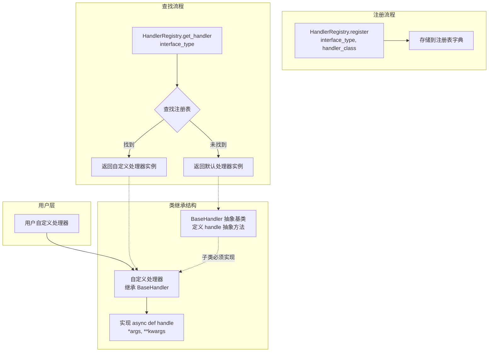

<!--
Copyright (c) 2026 Huawei Technologies Co., Ltd.
All Rights Reserved.

SPDX-License-Identifier: Apache-2.0

   Licensed under the Apache License, Version 2.0 (the "License"); you may
   not use this file except in compliance with the License. You may obtain
   a copy of the License at

        http://www.apache.org/licenses/LICENSE-2.0

   Unless required by applicable law or agreed to in writing, software
   distributed under the License is distributed on an "AS IS" BASIS, WITHOUT
   WARRANTIES OR CONDITIONS OF ANY KIND, either express or implied. See the
   License for the specific language governing permissions and limitations
   under the License.
-->

# 注册中心开发指南

## 特性介绍

注册中心是一个专注于Agent统一管理的服务，支持用户将来自不同厂商的Agent进行集中注册与管理，实现多源Agent的可控接入与维护。应用于A2A-T领域多厂商多智能体交互场景下的AgentCard统一注册和管理。

## 约束与限制

### 功能限制

- 本项目仅用作功能模块，非完整系统，模块自身不提供登录认证、鉴权、用户管理、日志审计、加解密、秘钥管理、数据库等能力，需由客户系统提供如上安全基础设施；源码中已预留相关方法函数，供二次定制实现。
- 默认所注册的 Agent 作为共享资源，读取路径只暴露状态为 `published` 的卡片。所有权隔离（`owner.isolation.enabled`）默认关闭；开启后所有者身份来自经过校验的 TLS 客户端证书或显式信任的反向代理，无所有者的卡片需管理员认领。身份信任链见[安全能力指南](注册中心安全能力指南.md)。
- 向本项目注册的AgentCard不可含有个人数据例如电话号码，不可含有敏感信息例如密码、凭据，否则有信息泄露风险。
- 本项目仅支持中英文两种语言的AgentCard注册。
- 当前支持单实例部署，仅用于内部系统，不可开放到公网，不可作为云服务部署。

### 操作限制

1. 本项目生产环境需要运行在Linux系统上，支持IPv4环境。Windows环境可用于开发调试，启动时会输出警告日志。

2. 注册的Agent数量上限默认为100个（可通过`etc/conf/server.properties`中`agent.num.max`配置修改）。

3. 请求体大小限制为1MB，URL长度限制为1KB。

4. 接口并发数限制：
   - 注册接口：最大50并发
   - 查询接口：最大100并发
   - 更新接口：最大100并发
   - 删除接口：最大50并发
   - JWK接口：最大1并发

5. 接口流控限制：
   - 注册接口：50次/秒
   - 查询接口：100次/秒
   - JWK接口：10次/秒

6. 自定义处理器注册时机：
   - 注册应在应用启动时完成，避免在业务处理过程中注册。

7. 自定义LLM实现时机：
   - 自定义LLM实现应在应用启动前完成，避免应用启动后完成导致找不到自定义的LLM。

### 证书要求

- server.cer：必选，身份证书，仅支持PEM编码格式，RSA密钥长度>=3072 bits。
- server_key.pem：必选，私钥文件，仅支持PEM编码格式。
- cert_pwd：必选，私钥口令文件，口令复杂度需满足至少8字符、至少两种字符类型。
- trust.cer：必选（当verify_client=true时），信任证书。
- 不支持国密证书。

## 环境准备

### 环境要求

- 操作系统：Linux（生产环境）；Windows可用于开发调试
- Python版本：3.12+
- 网络：IPv4环境
- 存储：支持文件存储、PostgreSQL（SQLite、GaussDB 代码预留，当前初始化工具仅支持 file 和 postgresql）

### 搭建环境

1. 获取源码

    ```bash
    git clone https://github.com/project-openan/registry-center.git
    cd registry-center
    ```

2. 创建虚拟环境

    ```bash
    # Linux环境
    python3 -m venv myproject_env
    source myproject_env/bin/activate
    ```

3. 安装依赖

    ```bash
    pip install -r requirements.txt
    ```

4. 配置服务

    执行初始化命令进行交互式配置：

    ```bash
    python -m agent_registry.init
    ```

    配置项包括：
    - HTTPS启用设置
    - TLS证书路径配置
    - 签名证书配置
    - 签名验证开关
    - Agent审核开关
    - 存储模式配置（file/postgresql）

    配置文件路径：
    - 服务配置：`etc/conf/server.conf`
    - 持久化配置：`etc/conf/persistence.conf`
    - LLM 配置：模型定义见 `etc/config/models.yaml`，密钥来自 `.env` 或进程环境变量（详见[附录4](#附录4llm-配置指南)）

5. 证书准备

    将证书文件放置到`etc/ssl/`目录：
    ```
    etc/ssl/server.cer      # 服务身份证书
    etc/ssl/server_key.pem  # 服务私钥
    etc/ssl/cert_pwd        # 私钥口令文件
    etc/ssl/trust.cer       # 信任证书
    ```

    设置证书文件权限：
    ```bash
    chmod 400 etc/ssl/*
    chmod 700 etc/ssl/
    ```

6. 配置 LLM

    在 `etc/config/models.yaml` 的 `models:` 下定义各项能力，并在该文件中用 `api_key_env` 填写保存密钥的环境变量名，密钥值放在仓库根目录 `.env` 或进程环境变量中。AOC 接口用 `provider: aoc_signed` 并配置 `auth.app_key_env`、`auth.app_secret_env`。详见[附录4](#附录4llm-配置指南)与 [`models.yaml.example`](../../etc/config/models.yaml.example)。

7. 检验环境是否搭建成功

    启动服务并查看日志：
    
    ```bash
    nohup python -m agent_registry.start > agent_registry.log 2>&1 &
    tail -f agent_registry.log
    ```
    
    看到以下日志表示启动成功：
    ```
    Uvicorn running on https://127.0.0.1:5000
    ```
    
    验证 LLM 配置是否加载成功： 
    
     ```bash 
     python -c "from common.llm import get_llm_instance, get_embed_instance; print(get_llm_instance().to_dict()); print(get_embed_instance().to_dict())" 
     ```

## Agent注册场景

### 使用场景概述

本场景描述如何将Agent注册到注册中心，包括AgentCard的构建、签名验证流程以及注册后的管理。

### 系统架构

注册中心系统架构如下：

```
┌─────────────────────────────────────────────────────────────┐
│                      客户端（Agent提供方）                      │
│  ┌─────────────┐    ┌─────────────┐    ┌─────────────────┐   │
│  │ AgentCard   │ -> │ 签名生成    │ -> │ REST API请求    │   │
│  │ 构建        │    │             │    │                 │   │
│  └─────────────┘    └─────────────┘    └─────────────────┘   │
└─────────────────────────────────────────────────────────────┘
                              │
                              │ HTTPS/TLS
                              ▼
┌─────────────────────────────────────────────────────────────┐
│                     注册中心服务                              │
│  ┌─────────────┐    ┌─────────────┐    ┌─────────────────┐   │
│  │ TLS验证     │ -> │ 签名验证    │ -> │ 安全检查        │   │
│  │             │    │             │    │ (Prompt注入等)   │   │
│  └─────────────┘    └─────────────┘    └─────────────────┘   │
│                              │                               │
│                              ▼                               │
│  ┌─────────────┐    ┌─────────────┐    ┌─────────────────┐   │
│  │ RegistryCore│ -> │ 持久化存储  │ -> │ 审核流程        │   │
│  │             │    │             │    │ (可选)          │   │
│  └─────────────┘    └─────────────┘    └─────────────────┘   │
└─────────────────────────────────────────────────────────────┘
                              │
                              ▼
┌─────────────────────────────────────────────────────────────┐
│                      存储层                                  │
│  ┌─────────────┐    ┌─────────────┐    ┌─────────────────┐   │
│  │ 文件存储    │    │ PostgreSQL  │    │ VectorDB        │   │
│  │ (默认)      │    │             │    │ (可选)          │   │
│  └─────────────┘    └─────────────┘    └─────────────────┘   │
└─────────────────────────────────────────────────────────────┘
```

核心组件说明：
- **RegistryCore**：核心注册逻辑，管理AgentCard的增删改查
- **AgentCardSignatureValidator**：签名验证组件
- **JWKProvider**：公钥提供组件，用于签名验证
- **Persistence**：持久化层，支持多种存储模式

### 开发流程

Agent注册开发流程：

```
1. 构建AgentCard
      │
      ▼
2. 生成AgentCard签名（可选）
      │
      ▼
3. 配置验签公钥（如启用签名验证）
      │
      ▼
4. 发送注册请求
      │
      ▼
5. 验证注册结果
```

### 接口说明

**表1** 主要接口列表

| 接口名 | 描述 |
|--------|------|
| POST /rest/v1/registry-center/agent-cards | 注册AgentCard |
| GET /rest/v1/registry-center/agent-cards | 查询AgentCard列表 |
| GET /rest/v1/registry-center/agent-cards/{org}/{name} | 查询指定AgentCard |
| PUT /rest/v1/registry-center/agent-cards/{org}/{name} | 更新指定AgentCard |
| DELETE /rest/v1/registry-center/agent-cards/{org}/{name} | 删除指定AgentCard |
| POST /rest/v1/registry-center/agent-cards/semantic-query | 按语义检索AgentCard |
| GET /rest/v1/registry-center/keys | 获取公钥信息 |

详细接口参数请参见[注册中心API参考](注册中心API参考.md)。

### 开发步骤

1. 构建AgentCard

    AgentCard是Agent的描述信息，包含以下核心字段：
    
    ```python
    from a2a.types import AgentCard, AgentProvider, AgentSkill, AgentCapabilities, AgentInterface
    
    agent_card = AgentCard(
        name="RAN Energy Saving Agent",
        description="负责RAN能效优化的自主闭环运行，包括意图探索、意图实现、效果评估与报告。",
        version="1.0.0",
        provider=AgentProvider(
            organization="Huawei",
            url="https://www.huawei.com"
        ),
        skills=[
            AgentSkill(
                id="ran-es-intent-exploration",
                name="RAN ES Intent Exploration",
                description="评估并确定指定RAN ES意图目标的最佳可能性",
                tags=["wireless", "energy-saving", "intent"]
            )
        ],
        capabilities=AgentCapabilities(
            streaming=True,
            push_notifications=False
        ),
        supported_interfaces=[
            AgentInterface(
                protocol_binding="GRPC",
                protocol_version="1.0.0",
                url="http://127.0.0.1:5000/"
            )
        ]
    )
    ```

    注意事项：
    - `name`和`provider.organization`组合作为唯一标识，不可重复注册。
    - `description`长度限制1~1000字符。
    - `skills`最多100个，每个技能描述最多4096字符。
    - 禁止包含Prompt注入关键词和高危Skill描述，详见[AgentCard安全规范](../../design/AgentCard_Security_Specification.md)。

2. 生成签名（可选）

    如需签名验证，需为AgentCard生成签名：

    ```python
    from a2a.utils.signing import create_signer
    from cryptography.hazmat.primitives import serialization
    
    # 加载私钥
    with open("sign_key.pem", "rb") as f:
        private_key = serialization.load_pem_private_key(f.read(), password=None)
    
    # 创建签名器并签名
    signer = create_signer(private_key, "RS256")
    signed_agent_card = signer(agent_card)
    ```

    签名要求：
    - 支持算法：RS256、ES256
    - 需配置对应的公钥到注册中心`etc/sign_verify/jwks/{org}/{agent_name}.json`

3. 配置验签公钥

    将验签公钥配置到注册中心：
    
    ```bash
    # 公钥文件格式：JWK Set
    mkdir -p etc/sign_verify/jwks/Huawei
    cat > etc/sign_verify/jwks/Huawei/TestAgent.json << 'EOF'
    {
      "keys": [
        {
          "kty": "RSA",
          "n": "base64url-encoded-modules",
          "e": "AQAB",
          "alg": "RS256",
          "use": "sig",
          "kid": "test-key-1"
        }
      ]
    }
    EOF
    ```

4. 发送注册请求

    使用HTTPS发送注册请求：
    
    ```python
    import requests
    import json
    
    # 序列化AgentCard
    agent_dict = {
        "name": "RAN Energy Saving Agent",
        "description": "负责RAN能效优化的自主闭环运行",
        "version": "1.0.0",
        "provider": {"organization": "Huawei", "url": ""},
        "skills": [...],
        "capabilities": {"streaming": True, "push_notifications": False},
        "supported_interfaces": [...]
    }
    
    # 发送请求
    response = requests.post(
        "https://127.0.0.1:5000/rest/v1/registry-center/agent-cards",
        json={"agentCards": [agent_dict]},
        cert=("client.cer", "client_key.pem"),  # 客户端证书
        verify="trust.cer"  # 信任证书
    )
    
    print(f"Status: {response.status_code}")
    ```

5. 验证注册结果

    查询已注册的Agent：
    
    ```python
    # 查询指定Agent
    response = requests.get(
        "https://127.0.0.1:5000/rest/v1/registry-center/agent-cards/Huawei/RAN%20Energy%20Saving%20Agent",
        cert=("client.cer", "client_key.pem"),
        verify="trust.cer"
    )
    
    agent_data = response.json()
    print(json.dumps(agent_data, indent=2))
    ```

### 调测验证

#### 验证服务状态

```bash
# 查看服务日志
tail -f agent_registry.log

# 查看注册数量
curl -k --cert client.cer --key client_key.pem \
  https://127.0.0.1:5000/rest/v1/registry-center/agent-cards
```

#### 验证签名功能

```bash
# 获取注册中心公钥
curl -k https://127.0.0.1:5000/rest/v1/registry-center/keys

# 验证AgentCard签名有效性（通过注册接口测试）
```

#### 验证存储状态

```bash
# 文件存储模式：查看数据文件
cat data/agentcard.json
cat data/agentregistry.json
cat data/tags.json
```

## 语义检索场景

### 使用场景概述

语义检索场景用于根据自然语言任务描述，智能匹配最适合的Agent。

### 开发流程

```
1. 构建任务描述
      │
      ▼
2. 发送语义检索请求
      │
      ▼
3. 获取匹配Agent列表
```

### 开发步骤

1. 构建任务描述

    任务描述应为自然语言，描述需要完成的任务：

    ```json
    {
      "task": "需要查询意图报告"
    }
    ```

2. 发送检索请求

    ```python
    import requests

    response = requests.post(
        "https://127.0.0.1:5000/rest/v1/registry-center/agent-cards/semantic-query",
        json={"task": "需要查询意图报告"},
        cert=("client.cer", "client_key.pem"),
        verify="trust.cer"
    )
    ```

3. 处理检索结果

    ```python
    result = response.json()
    for agent in result.get("agentCards", []):
        print(f"Agent: {agent['name']}")
        print(f"Description: {agent['description']}")
    ```

    注意事项：
    - 检索基于Agent的description和skills进行语义匹配。
    - 使用LLM进行智能筛选。
    - 返回最多top_n个匹配结果。

## CLI管理场景

### 使用场景概述

注册中心提供CLI命令行工具，用于本地管理Agent和标签。

### 开发步骤

1. 启动CLI

    ```bash
    python -m agent_registry.cli
    ```

2. Agent管理命令

    ```bash
    # 查询Agent列表
    agent list

    # 查询Agent详情
    agent get --agent-name "RAN Energy Saving Agent" --org "Huawei"

    # 审核Agent（需开启审核功能）
    agent approval -n "RAN Energy Saving Agent" --org "Huawei"
    ```

3. 标签管理命令

    ```bash
    # 创建标签
    tag create --name "wireless"

    # 查询标签列表
    tag list

    # 为Agent设置标签
    agent set-tags -n "RAN Energy Saving Agent" -o "Huawei" -t "wireless,energy-saving"

    # 删除标签
    tag delete --id "tag-uuid"
    ```

    注意事项：
    - CLI通过Unix Domain Socket与服务通信，Windows下UDS不可用，CLI内部命令受限。
    - Socket路径（Linux）：`run/registry-center/internal.sock`。

## Agent健康监测与变更订阅场景

### 使用场景概述

注册中心支持Agent心跳检测与变更广播：Agent周期性上报存活状态，注册中心依据失败阈值维护健康状态（healthy/suspect/offline）；注册表数据变化（注册、更新、注销、健康状态变化）可通过Webhook实时推送给订阅方，并提供按版本号的对账接口。两个能力默认关闭，需在server.conf中开启，开启后行为对存量部署完全向后兼容。

开关放在 `etc/conf/server.conf`；心跳周期、失败阈值、流控和通知投递策略放在 `etc/conf/server.properties`。初始化向导只配置部署与开关，不改写业务策略。

### 开发步骤

1. 开启能力（etc/conf/server.conf）

    ```properties
    heartbeat.enabled=true
    broadcast.enabled=true
    ```

2. Agent集成心跳上报

    Agent按心跳响应中的interval周期上报，建议附加±10%随机抖动避免同步风暴；心跳时间以服务端接收时间为准：

    ```http
    POST /rest/v1/registry-center/agent-cards/{organization}/{name}/heartbeat
    ```

    接口详情请参见[注册中心API参考"Agent心跳上报"章节](./注册中心API参考.md#agent心跳上报)。

3. 订阅方接收变更通知

    先创建订阅登记回调地址与验签密钥；回调端点中必须校验X-Registry-Signature（HMAC-SHA256）与时间戳窗口后处理事件。接口详情请参见[注册中心API参考"创建变更订阅"章节](./注册中心API参考.md#创建变更订阅)，验签规范请参见[注册中心安全能力指南"变更广播安全"章节](./注册中心安全能力指南.md#变更广播安全)。

4. 订阅方对账补齐

    订阅方定期按registry_version增量拉取变更事件，防止漏事件：

    ```http
    GET /rest/v1/registry-center/changes?since={last_version}&limit=100
    ```

    注意事项：
    - 管理员可通过`GET /rest/v1/registry-center/agents/health`监控Agent健康状态，支持按status过滤。
    - 离线Agent默认仅标记不隐藏，可通过`heartbeat.hide.unhealthy.results=true`开启从任务发现结果中自动隐藏；健康状态列表/历史/SSE 不受该开关影响，离线告警始终可见。

## 配置扩展场景

### 使用场景概述

通过扩展配置实现自定义功能，包括存储模式切换、安全策略配置等。

### 开发步骤

1. 切换存储模式

    修改`etc/conf/persistence.conf`：

    ```properties
persistence.mode=postgresql
# Connection: etc/conf/db/postgresql.json
# Copy its .json.template; set password_env in environment / root .env.
```

2. 配置安全策略

    修改`etc/conf/server.conf`：

    ```properties
    # 签名验证开关
    signature_validation_enabled=true

    # Agent审核开关
    agent_approval_enabled=true

    # 所有者隔离开关
    owner.isolation.enabled=true
    owner.validation.mode=relaxed
    ```

3. 配置向量数据库

    ```properties
    # 启用向量数据库
    #
    # 注意：当前实现下该开关不是"为语义检索增加一个索引"，而是切换整条存储路径。
    # 打开后 RegistryCore 不再初始化 file/SQL 后端，AgentCard 只写入向量库，
    # 审批（依赖 update_status）、标签（含标签实体增删改查）、Card 列表、
    # 所有权、元数据与时间戳都返回 HTTP 503（AuthoritativeStoreUnavailable），不再静默返回空值；
    # 更新与注销同样被拒绝，因为它们无法向变更流宣告自己。
    # 注册、按主键精确读取，以及注册配额/重名检测仍可用（前者便于先把数据灌入集合，
    # 后两者是注册流程自身依赖，属刻意保留的索引读）。
    # 请勿在生产上直接开启；可设 startup.strict.storage=true 让进程在该模式下拒绝启动。
    # "权威存储 + 可重建索引"的正确分层是后续重构目标，尚未实现。
    use_vectordb=true
    ```

## 存储后端与启动预检查

注册中心通过 `etc/conf/persistence.conf` 中的 `persistence.mode` 选择可插拔的持久化后端：

SQL 模式写入 Agent 前，广播服务必须绑定同一个存储实例：`initialize_broadcast_service(registry.storage, registry.persistence_mode)`。正常服务启动会自动完成；嵌入式调用、CLI 脚本和测试需显式初始化。若广播单例此前以文件或内存 outbox 创建，启动会报错，不会静默使用非事务 outbox；未正确绑定时写入会在修改记录前失败。file/向量模式不受此 SQL 绑定要求影响。

| 模式 | 后端 | 驱动 |
|------|------|------|
| file | 本地JSON文件（默认） | — |
| sqlite | 内嵌SQLite数据库 | Python标准库sqlite3 |
| postgresql | PostgreSQL | psycopg2 |
| gauss | 华为GaussDB（PG协议兼容） | psycopg2 |
| mysql | MySQL 5.7+ / 8.0 | PyMySQL + DBUtils |

所有SQL后端共享同一套CRUD引擎（`agent_registry/persistence/sql_backend.py`），各自的方言SQL集中在 `agent_registry/persistence/sql_queries.py`。新增一种数据库需要：一个查询枚举、一个 `SqlStorageBackend` 子类、`agent_registry/persistence/__init__.py` 工厂中的一个分支，以及 `etc/conf/db/` 中的连接 profile 和模板。

### 配置示例（MySQL）

```properties
persistence.mode=mysql
# Connections: copy etc/conf/db/<profile>.json.template to <profile>.json.
# Secrets: password_env references the process environment or root .env.
```

容器 DB_* 变量由 Python 的连接 profile 直接读取，不再写入 persistence.conf；连接参数位于 etc/conf/db/，密码只从环境 / .env 获取。

### 启动预检查（快速失败）

`python -m agent_registry.start` 在绑定任何端口之前同步初始化所配置的存储后端——包括创建数据库（如缺失）、建立连接池、执行建表DDL以及一次 `SELECT 1` 往返校验。任一环节失败，进程会打印包含模式、目标地址、配置文件路径和可能原因的结构化错误框，然后以非零码退出：

```
================================================================================
[storage pre-check] FAILED to initialize storage backend.
  mode    : mysql
  target  : mysql://localhost:3306/registry_center (user: a2a_user)
  config  : .../etc/conf/persistence.conf
  error   : OperationalError(2003, "Can't connect to MySQL server ...")
  Likely causes (mysql):
    - server not running / wrong host or port (errno 2003)
    ...
================================================================================
```

所有SQL后端均支持 `<前缀>.connect_timeout` 配置（默认10秒），确保连接不可达时快速失败，而不是挂起启动流程。

## 自定义接口扩展场景

### 使用场景概述

本场景描述如何通过自定义接口扩展注册中心功能，包括自定义处理器和自定义大模型（LLM）两种扩展方式。通过统一的抽象基类和处理器注册机制，开发者可以灵活扩展系统功能，无需修改核心代码。

### 系统架构

自定义接口系统架构如下：

**自定义处理器架构：**

系统采用注册表模式，核心组件如表2所示：

**表2** 接口扩展核心组件

| 组件 | 职责 |
|------|------|
| BaseHandler | 定义所有处理器的统一抽象接口 |
| HandlerRegistry | 管理处理器注册和获取，提供默认实现兜底 |
| InterfaceType | 定义支持的接口类型枚举 |
| 默认处理器 | 为常见操作提供内置实现 |
| 自定义处理器 | 用户扩展实现，覆盖默认行为 |

```
┌─────────────────┐
│   业务调用方     │
└────────┬────────┘
         │
         ▼
┌─────────────────┐
│ HandlerRegistry │◄──── 注册自定义处理器
└────────┬────────┘
         │
         ▼
┌─────────────────┐
│  BaseHandler    │
│   (抽象基类)     │
└────────┬────────┘
     ┌───┴───┬───────────────┐
     ▼       ▼               ▼
┌───────┐ ┌───────┐  ┌───────────┐
│ 默认  │ │ 默认   │  │  自定义   │
│处理器1│ │处理器2 │  │  处理器3   │
└───────┘ └───────┘  └───────────┘
```

**图1** 处理器调用流程图



**自定义LLM架构：**

系统采用注册器模式与装饰器模式，核心组件如表3所示：

**表3** LLM架构核心组件

| 组件 | 职责 |
|------|------|
| BaseLLM | 定义所有LLM的抽象基类，提供统一的调用接口 |
| LLMProviderRegistry | 管理LLM提供者注册，支持装饰器注册 |
| LLMType | 定义支持的LLM类型枚举 |
| LLMConfig/LLMConfigItem | 管理LLM配置信息（模型、API、密钥等） |
| 默认LLM实现 | OpenAIStyleLLM、AOCChatLLM等内置实现 |
| 自定义LLM | 用户扩展实现，支持任意厂商接入 |

```
┌─────────────────────┐
│     业务调用方       │
└──────────┬──────────┘
           │
           ▼
┌─────────────────────┐
│   get_llm_instance  │
└──────────┬──────────┘
           │
           ▼
┌─────────────────────┐
│ LLMProviderRegistry │◄──── @registry_provider 注册自定义LLM
└──────────┬──────────┘
           │
           ▼
┌─────────────────────┐
│      BaseLLM        │
│     (抽象基类)       │
└──────────┬──────────┘
     ┌──────┴──────┬───────────────┐
     ▼             ▼               ▼
┌─────────┐ ┌──────────┐  ┌─────────────┐
│OpenAI   │ │ AOC      │  │  自定义     │
│StyleLLM │ │ ChatLLM  │  │  MyLLM      │
└─────────┘ └──────────┘  └─────────────┘
```

**目录结构：**
```
{安装目录}/registry-center/
├── common/
│   ├── config/
│   │      └── README_zh.md         # LLM 模型配置说明
│   ├── llm/
│   │   ├── config/
│   │   │      ├── __init__.py
│   │   │      ├── config_reader.py # 读取配置文件（向量库配置）
│   │   │      ├── llm_config.py    # LLMType和LLMConfig的类文件
│   │   │      └── model_sources.py # models.yaml 加载与协议 Profile
│   │   ├── provider/
│   │   │      ├── __init__.py
│   │   │      ├── base_llm.py              # 基类
│   │   │      ├── llm_provider_registry.py # 注册器
│   │   │      ├── llm_openai.py            # OpenAI风格LLM实现
│   │   │      ├── aoc_base_llm.py          # AOC基类
│   │   │      ├── aoc_chat_llm.py          # AOC对话模型
│   │   │      ├── aoc_embedding_llm.py     # AOC嵌入模型
│   │   │      └── aoc_reranker_llm.py      # AOC重排序模型
│   │   ├── __init__.py    # 模块导出文件
│   │   └── llm.py         # 获取llm实例
│   └── custom/
│          ├── __init__.py          # 自定义处理器注册文件（需用户新建）
│          ├── interface_type.py    # 接口类型枚举
│          └── custom_handle.py     # 处理器基类和注册表
```

### 自定义处理器使用说明

#### 功能介绍

**核心能力：**
- **抽象基类**：为所有处理器定义统一接口
- **默认实现**：为常见操作提供内置处理器
- **自定义扩展**：支持用户注册自定义处理器

#### 何时需要自定义处理器

以下场景需要用户自行实现自定义处理器：

**表4** 自定义处理器实现场景

| 场景 | 说明 | 示例 |
|------|------|------|
| 自定义解密逻辑 | 当需要使用非默认的解密方式时，需自定义处理器实现解密逻辑 | 使用特定的加密算法进行解密 |
| 自定义审计日志 | 当需要将审计日志存储到特定存储介质或添加额外信息时 | 将审计日志存储到ELK或数据库 |
| 自定义认证方式 | 当需要集成特定的认证系统时 | 集成LDAP、OAuth等认证系统 |
| 自定义存储逻辑 | 当需要使用特定存储介质存储Agent数据时 | 使用MySQL、MongoDB等存储Agent数据 |

#### 开发步骤

1. 在 `common/custom` 目录下新增 `__init__.py` 和 `my_custom_handle.py` 文件。

2. 在 `my_custom_handle.py` 文件中创建自定义处理器

    创建继承自BaseHandler的自定义类，并实现handle方法：
    ```python
    from common.custom.custom_handle import BaseHandler

    class MyCustomDecryptHandle(BaseHandler):
        """自定义解密处理器"""
        
        async def handle(self, *args, **kwargs):
            """
            自定义解密逻辑
            
            Args:
                *args: 位置参数
                **kwargs: 关键字参数
                
            Returns:
                解密结果
            """
            # 自定义实现
            result = "自定义结果"
            return result

    class MyCustomAuditHandle(BaseHandler):
        """自定义审计处理器"""
        
        async def handle(self, *args, **kwargs):
            # 自定义实现
            return "自定义结果"
    ```

3. 在 `__init__.py` 文件中注册自定义处理器

    在应用启动时注册自定义处理器：
    ```python
    from common.custom.custom_handle import HandlerRegistry
    from common.custom.interface_type import InterfaceType
    from common.custom.my_custom_handle import MyCustomDecryptHandle
    from common.custom.my_custom_handle import MyCustomAuditHandle

    # 注册自定义处理器
    # 注意：注册操作应在业务处理开始前完成
    HandlerRegistry.register(InterfaceType.DECRYPT, MyCustomDecryptHandle)
    HandlerRegistry.register(InterfaceType.AUDIT, MyCustomAuditHandle)
    ```

    > **注意**：如果同一个接口注册多个自定义处理器，后注册的会覆盖前面注册的处理器。请确保注册顺序符合预期。

4. 使用处理器

    在业务代码中获取并使用处理器：
    ```python
    from common.custom.custom_handle import HandlerRegistry
    from common.custom.interface_type import InterfaceType

    # 获取处理器实例
    # HandlerRegistry会自动返回已注册的自定义处理器或默认实现
    handle = HandlerRegistry.get_handler(InterfaceType.QUERY)

    # 使用处理器执行业务
    result = await handle.handle(...)
    ```

    > **说明**：上述流程由框架内部自动完成。在实际使用中，您只需调用统一的业务接口，无需关心处理器如何选择和执行。

#### 默认处理器说明

若未注册自定义处理器，系统将使用以下默认实现：

**表5** 默认处理器说明

| 处理器 | 对应接口类型 | 功能描述 | 参数说明 |
|--------|-------------|----------|----------|
| DecryptHandler | DECRYPT | 处理解密操作 | `ciphertext: str` 待解密的密文 |
| AuditHandler | AUDIT | 处理审计日志 | `log_entry: Dict` 包含 operation_name, level, result, object_name, details, client_ip, user_name |
| AuthenticateHandler | AUTHENTICATE | 处理认证 | `client_ip: str`, `request: Any`, `context: Dict` (可选) |
| InsertHandler | INSERT | 处理Agent数据保存 | `agent: AgentCard`, `initial_status: str` (kwargs), `owner: str` (kwargs) |
| QueryHandler | QUERY | 处理Agent数据查询 | `name: str` (可选), `organization: str` (可选) |
| UpdateHandler | UPDATE | 处理Agent数据修改 | `name: str`, `organization: str`, `agent_data: Dict`, `owner: str` (kwargs) |
| GetHandler | GET | 处理Agent精准查询 | `name: str`, `organization: str`, `owner: str` (kwargs) |
| RetrieveHandler | RETRIEVE | 处理Agent检索 | `task: str`, `top_n: int` |
| DeregisterHandler | DEREGISTER | 处理Agent删除 | `name: str`, `organization: str`, `owner: str` (kwargs) |

#### 调测验证

验证默认处理器:
```python
from common.custom.custom_handle import HandlerRegistry
from common.custom.interface_type import InterfaceType

# 验证默认处理器
handler = HandlerRegistry.get_handler(InterfaceType.QUERY)
assert handler is not None, "处理器获取失败"
print(f"当前使用的处理器: {type(handler).__name__}")
```

验证自定义处理器注册:
```python
from common.custom.custom_handle import BaseHandler, HandlerRegistry
from common.custom.interface_type import InterfaceType

class TestHandle(BaseHandler):
    async def handle(self, *args, **kwargs):
        return "test_success"

# 注册前
handler_before = HandlerRegistry.get_handler(InterfaceType.INSERT)
print(f"注册前: {type(handler_before).__name__}")

# 注册
HandlerRegistry.register(InterfaceType.INSERT, TestHandle)

# 注册后
handler_after = HandlerRegistry.get_handler(InterfaceType.INSERT)
print(f"注册后: {type(handler_after).__name__}")

# 验证功能
result = await handler_after.handle()
assert result == "test_success", "自定义处理器未生效"
print("验证通过")
```

### 自定义 LLM 使用说明

注册中心从 `etc/config/models.yaml` 读取模型定义，从进程环境变量或仓库根目录的 `.env` 读取密钥；环境变量优先，空值不会覆盖 `.env`。详见 [LLM 配置说明](../../etc/config/README_zh.md) 和 [`.env.example`](../../.env.example)。

智能 Agent 筛选需要 `chat` 条目，语义检索需要 `embed`，启用重排序时另配 `rerank`。每种能力必须设置 `model` 与 `url`，可选设置 `provider`、`description`、`timeout`、`verify_ssl`、`enable_thinking`、`api_key_env`；`models:` 下出现哪些键就加载哪些能力。`provider` 默认 `openai_compatible`（旧别名 `openai` 同样可用）；`aoc_signed` 使用 `auth.app_key_env`、`auth.app_secret_env`。其他协议在 `common/llm/config/model_sources.py` 注册 provider profile，无需修改配置来源。

修改后重启服务，因为客户端会缓存。环境变量旧配置运行 `python -m scripts.migrate_llm_config`；旧 JSON 运行 `python -m scripts.migrate_legacy_llm_json`。两者均拒绝冲突且不输出密钥；自定义旧协议模板需先实现 Profile。

## 附录

### 附录1：配置文件说明

#### server.conf配置项

**表8** server.conf配置项说明

| 配置项 | 说明 | 默认值 |
|--------|------|--------|
| IP | 服务监听IP | 127.0.0.1 |
| PORT | 服务监听端口 | 5000 |
| enable_https | 启用HTTPS | true |
| ssl_certfile | 服务身份证书路径（仅cer格式） | etc/ssl/server.cer |
| ssl_keyfile | 服务私钥文件路径（仅pem格式） | etc/ssl/server_key.pem |
| ssl_keyfile_password | 私钥口令文件路径；文件内容是口令，不是口令本身 | etc/ssl/cert_pwd |
| ssl_ca_certs | 信任证书路径（仅cer格式） | etc/ssl/trust.cer |
| ssl_crl_file | 客户端证书吊销列表（CRL）路径；仅该行为生效行且文件存在时才启用吊销校验 | 注释（不启用吊销校验） |
| registry.sign.enabled | 注册中心签名开关 | true |
| verify_client | 校验客户端证书；仅字面量false关闭，其他取值（含拼写错误）仍校验 | true |
| forwarded_allow_ips | 可信反向代理地址（逗号分隔），其X-Forwarded-*头被采信；为空表示不信任任何代理 | 127.0.0.1 |
| jwk_cert_path | 独立签名证书路径；用于签名并向GET /rest/v1/registry-center/keys提供公钥JWK及kid | etc/sign_cert/sign.cer |
| jwk_private_key_path | 签名用PEM私钥文件路径（是文件，不是目录，不复用TLS密钥） | etc/sign_cert/sign_key.pem |
| jwk_private_key_password | JWK私钥明文口令文件路径；只有未加密私钥才可留空 | etc/sign_cert/cert_pwd |
| use_vectordb | 启用向量数据库（会切换权威存储，见上文警示） | false |
| startup.strict.storage | 当use_vectordb=true导致没有权威记录存储时拒绝启动；false仅告警后继续，公开模板已列出此键 | false |
| signature_validation_enabled | 签名验证开关 | true |
| jwk_allowlist | 允许用作jku的主机名清单（逗号分隔）；为空时禁用jku外部取键（fail closed） | 空 |
| agent_approval_enabled | Agent审核开关 | false |
| owner.isolation.enabled | 所有者隔离开关 | true |
| owner.validation.mode | Owner校验模式：strict要求CN格式且注册需有已验证身份；relaxed跳过格式检查并接受匿名注册 | relaxed |
| owner.identity.mode | 身份来源：certificate（已校验客户端证书的CN）/trusted_proxy/none | certificate |
| owner.trusted.proxy.ips | 允许断言X-SSL-Client-DN的反向代理IP（逗号分隔）；为空忽略所有此类头 | 空 |
| startup.strict.identity | 身份配置无法验证调用者时拒绝启动 | false |
| integration.enabled | 启用第三方接入HTTPS端口（独立于主端口身份） | false |
| integration.ip | 第三方接入端口绑定地址 | 127.0.0.1 |
| integration.port | 第三方接入端口的TCP端口；仅integration.enabled=true时生效，复用主TLS证书和私钥 | 5001 |
| integration.client_cert | 第三方端口要求客户端证书（mTLS）；为true时TLS握手要求证书，且integration.auth.mode完全未设置时认证模式默认mtls | false |
| integration.auth.mode | 第三方端口认证模式：static_bearer/mtls/oauth2_introspection/oauth2_jwt | oauth2_introspection |
| integration.auth.fingerprint_key | 令牌指纹（HMAC）密钥，用于审计与限流记录脱敏；除mtls外必填 | 空（由 ${INTEGRATION_FINGERPRINT_KEY} 注入） |
| integration.auth.static.hmac_key | static_bearer模式校验静态令牌的HMAC密钥（必填） | 空（由 ${INTEGRATION_TOKEN_HMAC_KEY} 注入） |
| integration.credential.file | 静态令牌摘要与mTLS调用方映射的凭据文件 | etc/conf/integration_credentials.conf |
| integration.oauth2.introspection_uri | IAM的RFC 7662令牌自省HTTPS端点；oauth2_introspection模式必填 | https://iam.example.com/oauth2/introspect |
| integration.oauth2.client_id | 注册中心访问自省端点的客户端ID（不是调用方凭据） | 空（由 ${OAUTH_INTROSPECTION_CLIENT_ID} 注入） |
| integration.oauth2.client_secret | 自省端点客户端密钥（HTTP Basic） | 空（由 ${OAUTH_INTROSPECTION_CLIENT_SECRET} 注入） |
| integration.oauth2.issuer | 期望的令牌签发者；iss不符即拒绝 | https://iam.example.com |
| integration.oauth2.audience | 期望的令牌受众；aud不含该值即拒绝 | registry-center |
| integration.oauth2.jwks_uri | 仅oauth2_jwt模式使用：JWT签名在本地按该地址发布的密钥校验 | 空 |
| integration.oauth2.ca_file | 校验IAM使用的CA文件；为空使用系统根证书 | 空 |
| integration.token.enabled | 启用令牌获取代理（IAM校验每个调用方自己的HTTP Basic凭据） | false |
| integration.token.provider | 令牌获取提供方ID；未知ID导致启动失败 | oauth2_client_credentials |
| integration.token.endpoint | 令牌获取HTTPS端点（不要在URL中内嵌凭据） | https://iam.example.com/oauth2/token |
| integration.token.ca_file | 校验令牌端点使用的CA文件；为空使用系统根证书 | 空 |
| heartbeat.enabled | 启用心跳检测与变更通知（时序与重试策略在server.properties） | false |
| heartbeat.hide.unhealthy.results | 隐藏疑似/离线Agent的任务发现结果；健康列表、历史、SSE与离线告警仍可见 | false |
| broadcast.enabled | 变更广播总开关；关闭时订阅接口返回503且不投递任何webhook | false |
| broadcast.allow.http.callbacks | 允许明文HTTP回调地址（仅开发环境） | false |
| broadcast.callback.allowlist | 允许的回调主机名（逗号分隔）；为空拒绝所有订阅 | 空 |
| agent_to_graph_enabled | 预留的Agent到图谱开关；当前仅产生一条启动日志，不导出Agent数据 | false |
| knowledge_graph.enabled | 启用主端口知识图谱API；关闭时相关接口一律返回404 | false |

说明：`${VAR:default}` 占位符由持久化加载器及明确支持它的集成模块解析（`${VAR}` 无默认值时按空值处理），机制见[存储后端与启动预检查](#存储后端与启动预检查)。**主监听器不解析占位符**：`enable_https`、`IP`、`PORT`、TLS文件路径请使用字面值或 `REGISTRY_*`；例如 `enable_https=true` 或 `REGISTRY_ENABLE_HTTPS=true`，不要写成 `enable_https=${DEPLOY_HTTPS:true}`。

环境覆盖的规范名为 `REGISTRY_` 加配置键的大写形式，将点替换为下划线，保留键内部的下划线；例如 `integration.auth.static.hmac_key` 对应 `REGISTRY_INTEGRATION_AUTH_STATIC_HMAC_KEY`。随程序分发的 `server.conf.example` 所声明的键，即使在旧 `server.conf` 中缺失或被注释，也可通过规范环境变量覆盖，直接 Python/systemd 启动同样支持。模板只声明**键名**，不导入示例默认值、不改写现有配置，也不会自动启用功能。自定义/插件键仍可通过已加载配置中的声明映射；安装时请保留公开模板文件。

说明：上表中 owner/身份相关行是示例 `etc/conf/server.conf` 的取值；代码内置默认值为
`owner.isolation.enabled=false`、`owner.validation.mode=strict`、`owner.identity.mode=certificate`，
详见[安全能力指南](注册中心安全能力指南.md)。

#### persistence.conf配置项

**表9** persistence.conf配置项说明

| 配置项 | 说明 | 默认值 |
|--------|------|--------|
| persistence.mode | 存储模式：file/postgresql/sqlite/gauss/mysql | file |
| audit.mysql.enabled | 审计记录归档到客户MySQL开关 | false |
| audit.mysql.batch_size | 每条INSERT写入的审计记录条数（受10000条队列上限约束） | 50 |
| audit.mysql.flush_interval | 空闲轮询与写失败后的暂停间隔（秒，可带小数） | 2 |

说明：审计归档默认关闭，本地审计文件仍是权威记录来源，归档失败只告警并降级为本地记录；
随程序分发的 `persistence.conf.example` 所声明的键，即使在 `persistence.conf` 中缺失或被注释，也可通过 `REGISTRY_AUDIT_MYSQL_*` 覆盖；模板默认值不会自动导入。

说明：持久化配置中的 `${VAR:default}` 占位符在加载时解析（`${VAR}` 无默认值时按空值处理），机制见[存储后端与启动预检查](#存储后端与启动预检查)；随后应用 `REGISTRY_*` 覆盖，再进行支持的口令解密。映射以已加载的键及公开模板声明为准，不要求部署文件重复声明模板已有的键。

#### server.properties 配置项（运行参数与业务策略）

 以下配置在 `etc/conf/server.properties` 中：

**表10** server.properties配置项说明

| 配置项 | 说明 | 默认值 | 
|--------|------|--------| 
| tls.version | **不生效**：没有任何代码读取该键；两个HTTPS监听器都用Python的TLS默认版本（TLS1.2～TLS1.3），当前无法通过配置禁用TLS1.2 | TLSv1.3,TLSv1.2 |
| tls.cipher | TLS密码套件列表（IANA名称，逗号分隔），转换后应用于主监听器与第三方监听器；未知名称跳过并告警，缺少该键会导致主监听器启动失败 | 见配置文件（10个套件） |
| connection.timeout | 主API请求处理超时（秒），超时返回HTTP 504；同时作为uvicorn的优雅关闭超时 | 300 |
| connection.max | 主API最大并发响应数（含流式响应，不含TCP连接），超出返回HTTP 503 | 500 |
| flowcontrol.ratelimit.register | 注册接口（创建AgentCard）每客户端IP请求速率（次/秒），超出返回HTTP 429 | 50 |
| flowcontrol.ratelimit.query | 查询接口（列表/读接口、健康列表与历史、/changes）限速（次/秒） | 100 |
| flowcontrol.ratelimit.update | 更新接口（PUT单个AgentCard）限速（次/秒） | 100 |
| flowcontrol.ratelimit.get | 获取单个AgentCard限速（次/秒） | 100 |
| flowcontrol.ratelimit.retrieve | 语义检索接口限速（次/秒） | 100 |
| flowcontrol.ratelimit.deregister | 注销接口（DELETE单个AgentCard）限速（次/秒） | 50 |
| flowcontrol.ratelimit.jwk | JWK接口（GET /keys，无需认证）限速（次/秒） | 10 |
| flowcontrol.ratelimit.heartbeat | 心跳上报接口限速（次/秒） | 100 |
| flowcontrol.ratelimit.subscription | 变更订阅接口（创建/查询/删除订阅）限速（次/秒） | 50 |
| flowcontrol.parallelism.register | 注册接口并发处理上限，超出返回HTTP 503 | 50 |
| flowcontrol.parallelism.query | 查询接口并发处理上限 | 100 |
| flowcontrol.parallelism.update | 更新接口并发处理上限 | 100 |
| flowcontrol.parallelism.get | 获取单个AgentCard并发上限 | 100 |
| flowcontrol.parallelism.retrieve | 语义检索并发上限 | 100 |
| flowcontrol.parallelism.deregister | 注销接口并发上限 | 50 |
| flowcontrol.parallelism.jwk | JWK接口并发上限；1表示读操作串行化 | 1 |
| flowcontrol.parallelism.heartbeat | 心跳上报并发上限 | 100 |
| flowcontrol.parallelism.subscription | 变更订阅接口并发上限 | 50 |
| agent.num.max | 已注册AgentCard数量上限，超出返回HTTP 409；同时用作Milvus列举全量的分页大小 | 100 |
| tag.max.count | 单个AgentCard标签数量上限（合并标签集超出即拒绝） | 10 |
| tag.max.length | 单个标签最大字符数；允许中文、A-Z a-z、0-9、. _ - | 50 |
| heartbeat.interval | 期望的心跳间隔（秒，最小1）；健康窗口=interval+grace，该值也在心跳应答中返回给Agent | 30 |
| heartbeat.failure.threshold | offline边界的interval倍数（最小1）：超过interval×threshold+grace进入offline；suspect从超过interval+grace开始，与此倍数无关（threshold=1跳过suspect） | 3 |
| heartbeat.grace.period | 各健康窗口附加的抖动余量（秒，最小0）；重启后每个Agent另获一个完整窗口 | 10 |
| heartbeat.sweep.interval | 后台健康巡检间隔（秒，最小1）；值越小状态发现越快、CPU开销越高 | 10 |
| heartbeat.offline.ttl | 离线Agent自动注销前的保留时长（秒，最小0；0=从不自动删除） | 0 |
| broadcast.debounce.window | 事件合并后向webhook刷写的缓冲时长（秒），用于合并突发事件 | 2.0 |
| broadcast.max.events.per.second | 单个订阅的webhook发送速率（个/秒）；令牌桶容量为max(2×rate,100)，超出等待而不丢弃 | 50 |
| broadcast.webhook.timeout | 单次webhook POST允许的时长（秒） | 10 |
| broadcast.webhook.max.retries | 单个投递批次内的重试次数（进程内总尝试=重试次数+1） | 5 |
| broadcast.webhook.backoff.base | 首次重试延迟基数（秒）；延迟=base×2^attempt，带±30%抖动 | 2 |
| broadcast.webhook.backoff.max | 上述指数退避延迟的上限（秒） | 300 |
| broadcast.outbox.retention.days | 事件在outbox中的保留天数；每3600次刷新循环清理，约3600×debounce.window秒加处理耗时（默认约两小时）；过期行可保留到下次清理，不是精确TTL | 7 |
| broadcast.delivery.max.attempts | 每个订阅与事件跨重启的总投递尝试次数（最小1），用尽后放弃投递 | 5 |
| broadcast.delivery.retry.interval | 重新入队失败投递的巡检间隔（秒）；0关闭该巡检任务 | 60 |
| integration.ratelimit | 第三方端口单个已认证凭据的请求速率（写作N/second或N，默认100/秒），超出返回HTTP 429；也限制按client_id获取令牌的次数 | 100/second |
| integration.preratelimit | 认证前按源IP的限速（N/second或N），用于减缓凭据猜测 | 50/second |
| integration.ban.threshold | 同一令牌指纹或源IP连续认证失败多少次后临时封禁 | 5 |
| integration.ban.cooldown_seconds | 被封禁桶的封禁时长（秒） | 300 |
| integration.oauth2.algorithms | 接受IAM签发JWT的签名算法（逗号分隔）；none被拒绝，至少需一项 | RS256 |
| integration.oauth2.timeout_seconds | IAM调用（JWKS获取与令牌自省）超时（秒），必须有限且>0 | 3 |
| integration.oauth2.cache_seconds | 自省结果缓存时长（秒）；0=不缓存，正值会延迟吊销的可见性 | 0 |
| integration.oauth2.cache_max_entries | 自省结果缓存容量（必须>0），先淘汰最旧条目 | 1024 |
| integration.auth.scope_role.registry.read | scope到调用方角色的映射：partner_service（读+订阅） | partner_service |
| integration.auth.scope_role.registry.vendor | scope到调用方角色的映射：vendor_agent（仅自己的卡片） | vendor_agent |
| integration.auth.scope_role.registry.admin | scope到调用方角色的映射：nms_oss（接近完全访问） | nms_oss |
| integration.auth.scope_role.registry.audit | scope到调用方角色的映射：analytics_tool（只读+拉取审计） | analytics_tool |
| integration.token.allowed_scopes | 注册中心可向IAM申请的scope（空格分隔）；默认scope必须是其子集，否则启动失败 | registry.read registry.vendor |
| integration.token.default_scope | 调用方未指定时申请的scope（须为allowed_scopes的子集） | registry.read |
| integration.token.timeout_seconds | 内置与自定义令牌获取提供方的整体协作超时（秒，有限且>0） | 3 |
| knowledge_graph.ratelimit | 知识图谱接口每客户端IP请求速率（N/second或N），超出返回HTTP 429 | 100/second |
| knowledge_graph.allowed.owners | 允许无需knowledge_graph:read/write scope即可读写图谱的已验证owner（逗号分隔）；为空时仅凭scope授权 | 空 |
| audit.read_operations | 是否同时审计主端口读操作；默认false（高频查询不入审计日志），第三方接入端口的读操作始终审计 | false |

### 附录2：错误码说明

**表11** 错误码说明

| 错误码 | 说明 |
|--------|------|
| SIG001 | signatures字段缺失 |
| SIG005 | 签名验证失败 |
| SIG999 | 签名验证内部错误 |
| 400 | 参数校验失败 |
| 401 | 签名验证失败 |
| 403 | 权限拒绝 |
| 404 | Agent未找到 |
| 409 | 重复注册/注册上限超出 |
| 429 | 流控限制 |
| 500 | 服务内部错误 |
| 503 | 服务繁忙 |

### 附录3：安全规范

AgentCard注册需遵循安全规范，禁止：
- Prompt注入攻击（忽略指令、越狱、强制执行等关键词）
- 高危Skill描述（提权、数据窃取、网络攻击等关键词）

详细规范请参见[AgentCard安全规范](../../design/AgentCard_Security_Specification.md)。

### 附录4：LLM 配置指南

模型定义放在被 Git 忽略的 `etc/config/models.yaml`，密钥放在仓库根目录 `.env` 或进程环境变量（进程环境变量优先）。完整说明见 [LLM 配置参考](../../etc/config/README_zh.md)。每种能力需配置 `model` 和 `url`；`provider` 选择协议配置（`openai_compatible`，旧别名 `openai` 同样可用；或 `aoc_signed`），其他参数包括 `api_key_env`、`timeout`、`verify_ssl`、`enable_thinking`。在 `models:` 下增删键即可改变加载的能力集合，配置修改后重启服务。

## FAQ

### 1：Windows环境能否运行注册中心？

可以。注册中心支持Windows环境用于开发调试，启动时会输出警告日志提示非生产环境。Windows下内置服务使用TCP协议（127.0.0.1:1108），Linux下使用UDS。启动入口统一为：`python -m agent_registry.start`。

### 2：如何关闭签名验证？

修改`etc/conf/server.conf`：
```properties
signature_validation_enabled=false
```

### 3：如何关闭客户端证书验证？

修改`etc/conf/server.conf`：
```properties
verify_client=false
enable_https=false
```

### 4：注册Agent时提示"重复Agent"怎么办？

该Agent的(name, organization)组合已存在，需要：
1. 使用不同的名称或组织
2. 或使用更新接口修改现有Agent
3. 或先删除再注册

### 5：签名验证失败怎么办？

可能原因：
1. 未配置验签公钥到`etc/sign_verify/jwks/{org}/{agent_name}.json`
2. AgentCard未包含signatures字段
3. 签名算法不匹配（仅支持RS256、ES256）
4. JKU URL无法访问

解决方案：
1. 检查公钥配置路径和格式
2. 确保AgentCard正确签名
3. 确认签名算法
4. 确认JKU URL可访问

### 6：如何配置PostgreSQL存储？

1. 修改`etc/conf/persistence.conf`：
```properties
persistence.mode=postgresql
# Connections: copy etc/conf/db/<profile>.json.template to <profile>.json.
# Secrets: password_env references the process environment or root .env.
```

2. 创建数据库：
```sql
CREATE DATABASE registry_center;
```

3. 重启服务

### 7：CLI命令执行失败怎么办？

可能原因：
1. Windows环境下CLI通过UDS通信不可用（CLI仅支持Linux）
2. 服务未启动内部服务（检查`run/registry-center/internal.sock`是否存在）
3. Socket权限问题

解决方案：
1. 在Linux环境运行
2. 确保服务正常启动
3. 检查Socket文件权限

### 8：自定义处理器未生效怎么办？

可能原因：
1. 注册操作在获取处理器之后执行
2. 注册的接口类型与实际使用的不匹配
3. 自定义处理器未正确继承BaseHandler

解决方案：
1. 确保在应用启动时、任何业务处理之前完成注册
2. 检查注册和获取时使用的InterfaceType是否一致
3. 确认自定义处理器正确继承了BaseHandler并实现了handle方法

### 9：新模型不可用怎么办？

检查 `etc/config/models.yaml` 的 `models:` 下是否有该能力的条目，`model` 和 `url` 是否已配置，以及其 `provider` profile 是否已注册。进程环境变量优先于 `.env`。修改配置后重启服务。

数据库连接规范已更新 / Connection configuration now uses [etc/conf/db profiles](../database-configuration.md). `persistence.conf` retains the selector and audit policies only; connection settings live only in the etc/conf/db profiles.
